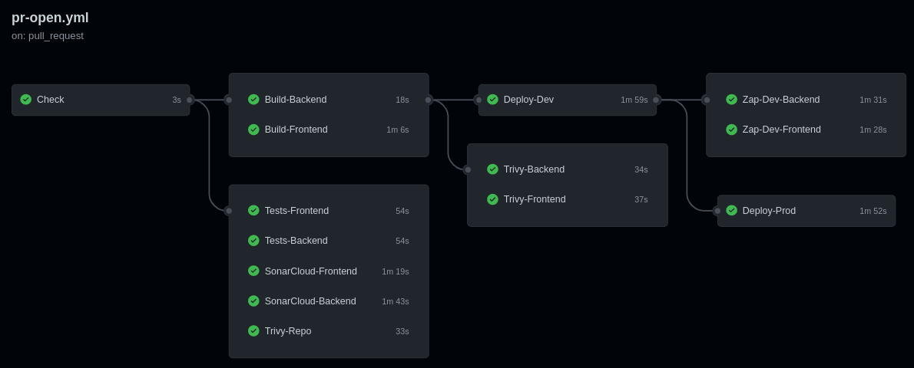
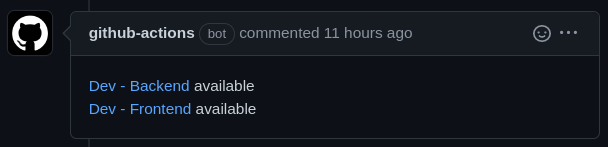
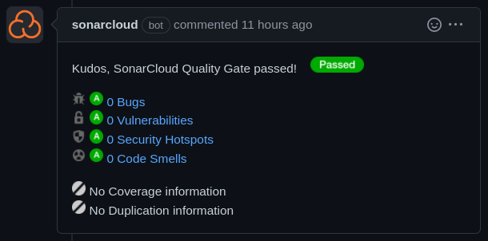
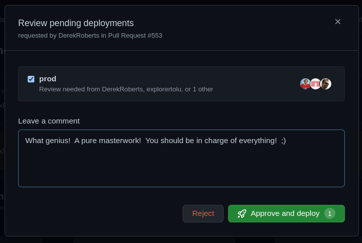
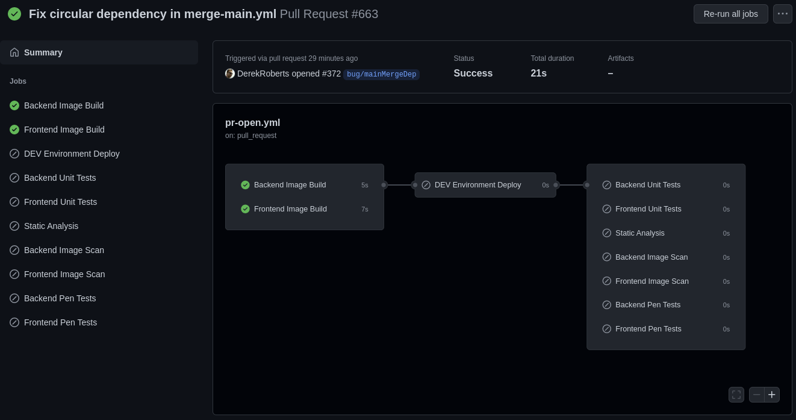
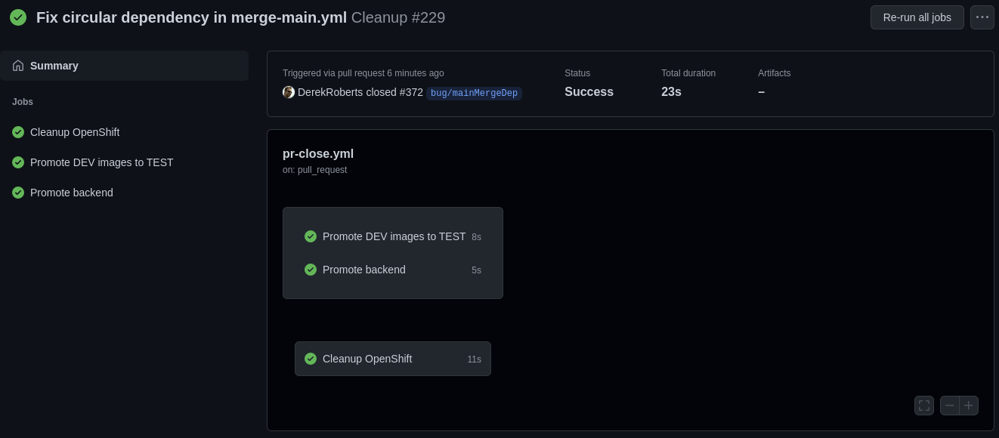
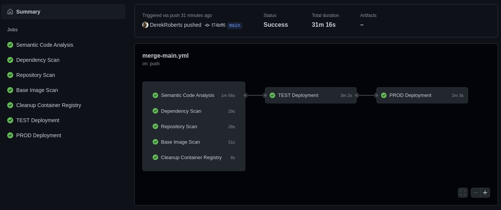

<!-- PROJECT SHIELDS -->

# Greenfield Template - DevOps Quickstart

## Overview

The Greenfield-template is a fully functional set of pipeline workflows and a starter application stack intended to help Agile DevOps teams hit the ground running.  Currently supports OpenShift with plans for AWS (Amazon Web Services).  Pipelines are run using [GitHub Actions](https://github.com/bcgov/greenfield-template/actions).

Features:
* Pull Request-based pipeline
* Sandboxed development deployments
* Gated production deployments
* Container publishing (ghcr.io) and importing (OpenShift)
* Security, vulnerability, infrastructure and container scan tools
* Automatic dependency patching with Pull Requests
* Enforced code reviews and pipeline checks
* Templates and setup documentation
* Starter TypeScript application stack

This project is in active development.  Please visit our [issues](https://github.com/bcgov/greenfield-template/issues) page to view or request features.

TODO: Update pic

### Deployments

Out-of-the-box, sandboxed, pull request-based development deployments allowing for multiple developers to work on and see their features at once.

Deployment to production is gatekept using GitHub environments, requiring sign off from code maintainers.

Deployment to test, staging or pre-prod (pick a name!) is currently planned to be transitory, allowing access to gatekept data, but only stopping before production deployment if a failure occurs.  (work in progress)

Successful deployments are linked in Pull Request comments.

TODO: Update pic

### Builds

Builds are handled by Docker Actions and published to the GitHub Container Registry (ghcr.io).  This allows for publicly accessible builds that can be consumed by OpenShift, Amazon Web Services or any other container service.

### Testing

Unit tests are run in jest, but other test frameworks can always be installed.  SonarCube should be configured to pick up sarif files and provide coverage reports.

### Code Quality

Code quality is reporting are performed by:

* SonarCloud
* CodeQL

Sonar reports are provided as Pull Request comments.

### Code Coverage

Code coverage is generated by any included tests.  Results are provided as Pull Request comments.

TODO: Code coverage pic here!

### Security Scanning

Dependency, container and vulnerability scanning is performed by:

* Trivy
* Snyk

### Penetration Testing

Penetration testing and reporting is performed by:

* OWASP ZAP

### Dependency patching

Dependency scanning and patching by PR is performed by:

* Snyk

### Higher-Level Environments

Higher-level environments come after DEV deployments and are usually called any of TEST, STAGING, PRE-PROD or PROD.  Since data and token access is more frequently sensitive access must be controlled by only allowing access from a merge to the main branch.

### Higher-Leven Environment Gatekeeping

Optionally, higher-level deployments can be prevented until manually approved.

TODO: update pic

## Workflows

### Pull Request Opened/Modified

This workflow is triggered when a Pull Request to the main branch is created or modified.  Each development deployment is separate, using its own stack.  This avoids collisions between development environments and provides isolation for testing and experimentation.  Pipeline steps are enforced, preventing merge of failing code.

The workflow, located [here](https://github.com/bcgov/greenfield-template/blob/main/.github/workflows/pr-open.yml), includes:

* [Pull Request](https://github.com/bcgov/greenfield-template/pulls)-based ephemeral, sandboxed environments
* [Docker](https://github.com/marketplace/actions/build-and-push-docker-images)/[Podman](https://podman.io) container building
* [Build caching](https://github.com/marketplace/actions/cache) to save time and bandwidth
* [GitHub Container Registry](https://github.com/bcgov/greenfield-template/pkgs/container/greenfield-template) image publishing
* [RedHat OpenShift](https://www.redhat.com/en/technologies/cloud-computing/openshift) deployment, with other options under consideration
* [Jest](https://jestjs.io/) JavaScript testing enforced in-pipeline
* [SonarCloud](https://sonarcloud.io/) static analysis test coverage reporting
* [Tryvy](https://aquasecurity.github.io/trivy) image, infrastructure and config scanning
* [OWASP ZAP](https://www.zaproxy.org/) Zed Attack Proxy web app penetration testing

TODO: update pic

Builds can be run or skipped with directory triggers.  Documentation, for example, will not require most pipeline steps.

TODO: update pic

## Pull Request Cleanup Pipeline

The workflow, located [here](https://github.com/bcgov/greenfield-template/blob/main/.github/workflows/pr-close.yml), includes:

* OpenShift dev artifact pruning
* ghcr.io cleanup of dev images over 14 days-old

Close and reopen a pull request to remove and reopen a pipeline to clear all of its artifacts.  This is a decreasingly common part of the troubleshooting process.

TODO: update pic

## Pull Request Main Merge Pipeline

The workflow, located [here](https://github.com/bcgov/greenfield-template/blob/main/.github/workflows/main.yml), includes:

* [GitHub CodeQL](https://codeql.github.com/) semantic code analysis and vulerability scanning
* [SonarCloud](https://sonarcloud.io/) continuous code quality and security scanning
* [Snyk](https://snyk.io/) vulnerability scanning and PR-based dependency patching
* [Tryvy](https://aquasecurity.github.io/trivy) repository and base image scanning
* Higher-level deployments (e.g. TEST, STAGING, PRE-PROD, PROD)

TODO: update pic

# Starter Application

The starter stack includes a frontend, backend and postgres database.  The frontend and backend are buld with [NestJS](https://docs.nestjs.com).  They currently do very little, but provide placeholders for more functional products.  See the backend and frontend folders for source, including Dockerfiles.

Features:
* [TypeScript](https://www.typescriptlang.org/) strong-typing for JavaScript
* [NestJS](https://docs.nestjs.com) frontend and backend
* [ESLint](https://eslint.org/) linting enforced on code staging (currently disabled)
* [Postgres](https://www.postgresql.org/) database

Local development can be supported using Docker Compose.  Please be aware that Podman and Podman Compose work as drop-in replacements for the Docker counterparts.

`docker-compose up -d`

# Getting Started

Initial setup is intended to take four hours or less.  This depends greatly on intended complexity, features selected/excluded and outside cooperation.

Please read [our setup guide](./SETUP.md) for more information.

## Example APIs, UIs and Metabase/Oracle Templates

Templates for APIs, UIs and Metabase/Oracle can be used to kickstart or extend projects.  Please visit our collaborators' [NR Architecture Templates](https://github.com/bcgov/nr-arch-templates) repository for more information.
