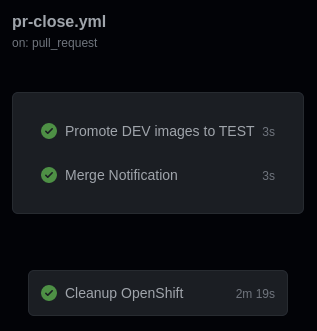
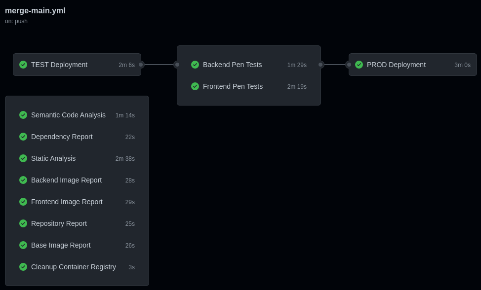
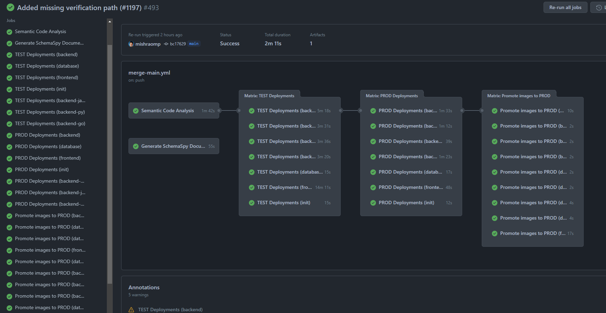
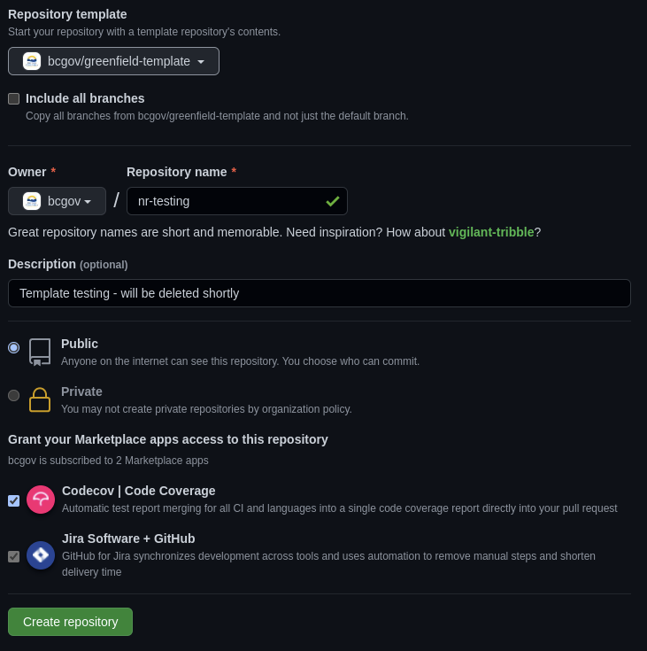

<!-- PROJECT SHIELDS -->

[](/../../graphs/contributors)
[](/../../network/members)
[](/../../stargazers)
[](/../../issues)
[](/LICENSE.md)
[](https://github.com/bcgov/repomountie/blob/master/doc/lifecycle-badges.md)
[](https://sonarcloud.io/summary/new_code?id=bcgov_nr-quickstart-typescript)


# Natural Resources QuickStart

Courtesy of the Forestry Suite of Applications Program from the Ministry of Land, Water and Resource Stewardship.

## Index

[Overview](#overview) - Deployments, images, containers and other features

[Workflows](#workflows) - The three-stage pipeline

[Getting Started](#getting-started) - Get set up!

[Troubleshooting](#troubleshooting) - Common problems

## Overview

The DevOps Quickstart is a fully functional set of pipeline workflows and a starter application stack intended to help Agile DevOps teams hit the ground running.  Currently OpenShift is supported with plans for AWS (Amazon Web Services).  Pipelines are run using [GitHub Actions](https://github.com/bcgov/nr-quickstart-typescript/actions).

Features:
* Pull Request-based pipeline
* Sandboxed development deployments
* Gated production deployments
* Container publishing (ghcr.io) and importing (OpenShift)
* Security, vulnerability, infrastructure and container scan tools
* Automatic dependency patching with Pull Requests
* Enforced code reviews and pipeline checks
* Templates and setup documentation
* Starter TypeScript application stack

This project is in active development.  Please visit our [issues](https://github.com/bcgov/nr-quickstart-typescript/issues) page to view or request features.

### Workflow 1 of 3: PR Open


### Workflow 2 of 3: PR Close



### Workflow 3 of 3: Main Merge



### Deployments

Out-of-the-box, sandboxed, pull request-based development deployments allowing for multiple developers to work on and see their features at once.

Deployment to production is gatekept using GitHub environments, requiring sign off from code maintainers.

Deployment to test, staging or pre-prod (pick a name!) is currently planned to be transitory, allowing access to gatekept data, but only stopping before production deployment if a failure occurs.  (work in progress)

Successful deployments are linked in Pull Request comments.


### Builds

Builds are handled by Docker Actions and published to the GitHub Container Registry (ghcr.io).  This allows for publicly accessible builds that can be consumed by OpenShift, Amazon Web Services or any other container service.


### Testing

Unit tests are run in jest, but other test frameworks can always be installed.  SonarCube should be configured to pick up sarif files and provide coverage reports.

### Code Quality

Code quality is reporting are performed by:

* SonarCloud
* CodeQL

Sonar reports are provided as Pull Request comments.


### Security Scanning

Dependency, container and vulnerability scanning is performed by:

* Trivy

### Penetration Testing

Penetration testing and reporting is performed by:

* OWASP ZAP

### Dependency Management

Dependency scanning, patching and updating by PR is performed by:

* Dependabot

### Higher-Level Environments

Higher-level environments come after DEV deployments and are usually called any of TEST, STAGING, PRE-PROD or PROD.  Since data and token access is more frequently sensitive access must be controlled by only allowing access from a merge to the main branch.

### Higher-Level Environment Gatekeeping

Optionally, higher-level deployments can be prevented until manually approved.


## Workflows

### 1: Pull Request Opened/Modified

This workflow is triggered when a Pull Request to the main branch is created or modified.  Each development deployment is separate, using its own stack.  This avoids collisions between development environments and provides isolation for testing and experimentation.  Pipeline steps are enforced, preventing merge of failing code.

The workflow, located [here](https://github.com/bcgov/nr-quickstart-typescript/blob/main/.github/workflows/pr-open.yml), includes:

* [Pull Request](https://github.com/bcgov/nr-quickstart-typescript/pulls)-based ephemeral, sandboxed environments
* [Docker](https://github.com/marketplace/actions/build-and-push-docker-images)/[Podman](https://podman.io) container building
* [Build caching](https://github.com/marketplace/actions/cache) to save time and bandwidth
* [GitHub Container Registry](https://github.com/bcgov/nr-quickstart-typescript/pkgs/container/nr-quickstart-typescript) image publishing
* [RedHat OpenShift](https://www.redhat.com/en/technologies/cloud-computing/openshift) deployment, with other options under consideration
* [Jest](https://jestjs.io/) JavaScript testing enforced in-pipeline
* [SonarCloud](https://sonarcloud.io/) static analysis test coverage reporting


Triggers are used to determine whether images need to be built or previous ones consumed.  Partial or full skips, like when limited to documentation, are shown below.


When a PR is merged, the message comment below is added.  Despite showing on this pull request it is actually handled by the next pipeline.


### 2: Pull Request Close Pipeline

The workflow, located [here](https://github.com/bcgov/nr-quickstart-typescript/blob/main/.github/workflows/pr-close.yml), fires when a pull request is closed.

* ghcr.io cleanup of dev images over 14 days-old
* OpenShift dev artifact removal

When a pull request is merged to main, one additional job is run.  This promotes the new images to the TEST environment.

* Image promotion to higher-level environments


If this closure was triggered by a merge to the main branch it will trigger the following workflow.

### 3: Pull Request Main Merge Pipeline

The workflow, located [here](https://github.com/bcgov/nr-quickstart-typescript/blob/main/.github/workflows/merge-main.yml), includes:

* [GitHub CodeQL](https://codeql.github.com/) semantic code analysis and vulerability scanning
* [OWASP ZAP](https://www.zaproxy.org/) Zed Attack Proxy web app penetration testing
* [SonarCloud](https://sonarcloud.io/) static analysis for continuous code quality and security scanning
* [Tryvy](https://aquasecurity.github.io/trivy) repository and base image scanning
* Higher-level deployments (e.g. TEST, STAGING, PRE-PROD, PROD)
* Publishing of production images to the GitHub Container Registry (ghcr.io)



## Starter Application

The starter stack includes a frontend, backend and postgres database.  The frontend and backend are buld with [NestJS](https://docs.nestjs.com).  They currently do very little, but provide placeholders for more functional products.  See the backend and frontend folders for source, including Dockerfiles.

Features:
* [TypeScript](https://www.typescriptlang.org/) strong-typing for JavaScript
* [NestJS](https://docs.nestjs.com) frontend and backend
* [ESLint](https://eslint.org/) linting enforced on code staging (currently disabled)
* [Postgres](https://www.postgresql.org/) database

Local development can be supported using Docker Compose.  Please be aware that Podman and Podman Compose work as drop-in replacements for the Docker counterparts.

`docker-compose up -d`

### Example APIs, UIs and Metabase/Oracle Templates

Templates for APIs, UIs and Metabase/Oracle can be used to kickstart or extend projects.  Please visit our collaborators' [NR Architecture Templates](https://github.com/bcgov/nr-arch-templates) repository for more information.

## Getting Started

Initial setup is intended to take four hours or less.  This depends greatly on intended complexity, features selected/excluded and outside cooperation.

### Contents

* Documentation:
    * *.md
* Workflows:
    * Pull Request-based (.github/workflows/pr-open.yml)
    * On Close (.github/workflows/pr-close.yml)
    * Main Merge (.github/workflows/main.yml)
* Hello World! starter application
    * TypeScript source in src/
    * One Jest test in test/
    * JavaScript container in Dockerfile
* Misc:
    * nestjs
    * eslint
    * lint-staged

Not included:

* Repository secrets
* Environment secrets
* Issues
* Pull requests
* JavaScript (transpiled/created in dist/)

### Prerequisites

The following are required:

* BC Government IDIR accounts for anyone submitting requests
* GitHub accounts for all participating team members
    * [Sign Up is free](https://github.com/signup)
* Membership in the BCGov GitHub organization
    * Provide GitHub IDs to [BCGov's Just Ask](https://just-ask.developer.gov.bc.ca/)
* Project namespaces (pick one):
    * OpenShift - [Register a New Project](https://registry.developer.gov.bc.ca/public-landing)
    * Amazon Web Services - coming soon!


### Consuming This Template



Create a new repository using this repository as a template.
* Select bcgov/nr-quickstart-typescript under Repository template
* Check Codecov | Code Coverage to grant access
* Jira cannot be unchecked (I try every time!)


### Setting Up the GitHub Repository


#### Pull Request Handling

Squash merging is recommended for simplified histories ad ease of rollback.

Cleaning up merged branches is recommended for your DevOps Specialist's fragile sanity.

From GitHub:
1. Select Settings (gear, top right) -> General (selected automatically)
2. Scroll to Pull Requests
    * `[check] Allow squash merging`
    * `[check] Automatically delete head branches`


### Closing Repo-Mountie Issues

repo-mountie is a BCGov bot that likes to spam us.  Here are a few issues to expect.

Lets use common phrasing
 * Includes examples of inappropriate and preferred phrasing
 * The default branch should be named `main`
 * Close the issue

Add missing topics
 * Topics improve discoverability
 * Directions will be included
 * Close the issue


### Action Secrets

Action Secrets are consumed by workflows, including 3rd party Actions.  Please use Environment secrets for highly sensitive content.

Manage Action Secrets from your Repo > Settings > Secrets > Actions.


#### Required

**GITHUB_TOKEN**

* Default token, not viewable, common to all repositories
* Variable: `{{ secrets.GITHUB_TOKEN }}`

**GHPROJECT_TOKEN** (TODO: check that this is still in use)

* Personal Access Token for writing to Pull Requests
* Variable: `{{ secrets.GHPROJECT_TOKEN }}`

**OC_SERVER**

* OpenShift server address
* Variable: `{{ secrets.OC_SERVER }}`
* Value (pick one of):
    * `https://api.gold.devops.gov.bc.ca:6443`
    * `https://api.silver.devops.gov.bc.ca:6443`


#### Optional

Provide these tokens or comment their jobs out:

* ./github/workflows/pr-open.yml
* ./github/workflows/main.yml

**SONAR_TOKEN**

* Code quality and security scanning
* Request to [import a GitHub repository](https://github.com/BCDevOps/devops-requests/issues/new/choose)
* Variable: `{{ secrets.SONAR_TOKEN }}`


### Environment Secrets

Secrets can be grouped into and protected by Environments.  [Features include](https://docs.github.com/en/actions/deployment/targeting-different-environments/using-environments-for-deployment):

* Required reviewers
* Wait timer
* Deployment branches

Manage Environments and their Secrets from your Repo > Settings > Environments.

**Environment: dev**

Create a new Environment to hold the keys to our development deployment.

Environment name: `dev`

No protection rules are required yet:

 * [`unchecked`] Required reviewers
 * [`unchecked`] Wait timer
 * Deployment branches: `All branches`

**Environment: prod**

Create a new Environment to hold the keys to our development deployment.

Environment name: `prod`

Protection rules are required:

 * [`check`] Required reviewers
   * Provide GitHub IDs as appropriate
 * [`unchecked`] Wait timer
 * Deployment branches: `All branches`

#### Required

**NAMESPACE**

* OpenShift Development namespace (see **Prerequisites**)
* Variable: `{{ secrets.OC_NAMESPACE }}`

**OC_TOKEN**

* OpenShift pipeline account token (see **Getting an OpenShift Account Token**)
* Variable: `{{ secrets.OC_TOKEN }}`


#### Getting an OpenShift Account Token

Please assume that your OpenShift platform team has provisioned a pipeline account.

1. Login to your OpenShift cluster
    * E.g. BCGov [Gold](https://console.apps.silver.devops.gov.bc.ca/) or [Silver](https://console.apps.silver.devops.gov.bc.ca/)
2. Select your DEV namespace (provided by the OpenShift platform team)
3. Select Secrets (under Workloads for Administrator view)
4. Select `pipeline-token-...` or a similarly privileged token
5. Under Data, copy `token`
6. Paste into the GitHub Environment Secret `OC_TOKEN` (see above)

### First Pipeline Run

By now all relevant tokens should be provided.  We are going to assume that Synk and SonarCloud aren't on hand yet, so let's comment themout.  Please revise as appropriate.

Steps in this section use a terminal.  Several GUIs alternatives are avilable, but out of scope.

Required:
* Git CLI installed and configured
* Access to a command prompt:
    * Linux command terminal
    * MacOS command terminal
    * Windows Subsystem for Linux (WSL)


#### Create a Branch and Make Changes

1. Create and switch to a new branch
    ```
    git checkout -b <new-branch-name>
    ```
2. Edit the following workflows
    * Pull Requests: `.github/workflows/pr-open.yml`
    * Main Merge: `.github/workflows/main.yml`
3. Comment out the following jobs
    * `sonarcloud`
3. Stage changes and create commits (repeat as necessary)
    ```
    git add .github/workflows/
    git commit -m "Pipeline: comment out sonarcloud"
    ```
4. Push the commits
    ```
    # First time only
    git push -u origin <new-branch-name>

    # Subsequent times
    git push origin
    ```

#### Create a Pull Request

This is where things start to get exciting!

From your GitHub repository:
1. Select *Pull Requests*
2. Click *New pull request* (big green button)
    * Title: `Pipeline: comment out sonarcloud`
    * Body: `Pipeline: comment out sonarcloud`
    * Target Branch: `<new-branch-name>`
    * Source Branch: `main`
3. Proceed according the the pipeline's directions!

### Packages

Packages are available from your repository (link on right) or your organization's package lists.

E.g. https://github.com/orgs/bcgov/packages?repo_name=nr-quickstart-typescript

#### Branch Protection

This is required to prevent direct pushes and merges to the default branch.  One full pipeline run must be completed before Make sure that `main` is the default branch.

From GitHub:
1. Select Settings (gear, top right) -> Branches (under Code and Automation)
2. Click `Add Rule` or edit an existing rule
3. Under `Protect matching branches` specify the following:
    * Branch name pattern: `main`
    * `[check] Require a pull request before merging`
        * `[check] Require approvals` (default = 1)
        * `[check] Dismiss stale pull request approvals when new commits are pushed`
        * `[check] Require review from Code Owners`
    * `[check] Require status checks to pass before merging`
        * `[check] Require branches to be up to date before merging`
        * `Status checks that are required` requires to the search box to select:
            * `Check`
            * `Tests-Backend`
            * `Tests-Frontend`
            * `Build-Backend`
            * `Build-Frontend`
            * `Deploy-Dev`
            * `Deploy-Prod`
            * `Trivy-Repo`
            * `Trivy-Backend`
            * `Trivy-Frontend`
            * `Zap-Dev-Backend`
            * `Zap-Dev-Frontend`
            * `Zap-Prod-Backend`
            * `Zap-Prod-Frontend`
            * `SonarCloud` (optional)
    * `[check] Require conversation resolution before merging`
    * `[check] Include administrators` (optional)

### Adding Team Members

Don't forget to add your team members!  

From GitHub:
1. Select Settings (gear, top right) -> Collaborators and teams (under Access)
2. Click `Add people` or `Add teams`
3. Use the search box to find people or teams
4. Choose a role (one of)
    * `Read`
    * `Triage`
    * `Write`
    * `Maintain`
    * `Admin`
5. Click *Add <person-or-team>*


## Troubleshooting

* If failed to get authentication at the build docker image stage, check if updated to use the secrets [GHCR token and username](https://github.com/marketplace/actions/docker-build-push-action), the default GitHub token might not work

* If failed to authenticate to openshfit at the deploy stage, check if the service account “pipeline” has the right ability to get project and do deploy

* If networking is unsuccessful, even with routes in place, try adding network policies for ingress and inter-namespace traffic.
    ```
    oc process -f .github/openshift/networkPolicies.yml | oc apply -f -
    ```
