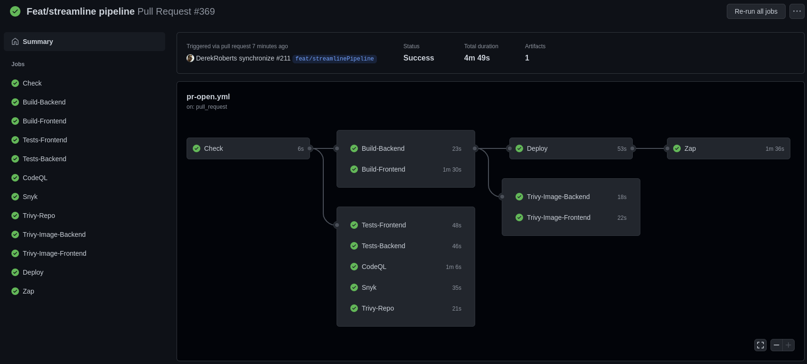

<!-- PROJECT SHIELDS -->

# greenfield-template
Forestry Client Services' greenfield template.  For testing and demonstration purposes.

This project is in active development.  Please visit our [issues](https://github.com/bcgov/greenfield-template/issues) page to view or request features.

Currently, our most exciting offering is the [GitHub Actions](https://github.com/bcgov/greenfield-template/actions) [pipeline](https://github.com/bcgov/greenfield-template/blob/main/.github/workflows/pr-open.yml), which includes:

* [Pull Request](https://github.com/bcgov/greenfield-template/pulls)-based ephemeral, sandboxed environments.
* [Docker](https://github.com/marketplace/actions/build-and-push-docker-images)(/Podman) container building.
* [Build caching](https://github.com/marketplace/actions/cache) to save time and bandwidth.
* [GitHub Container Registry](https://github.com/bcgov/greenfield-template/pkgs/container/greenfield-template) image publishing.
* [RedHat OpenShift](https://www.redhat.com/en/technologies/cloud-computing/openshift) deployment, with other options under consideration.
* [OpenShift artifact](https://github.com/bcgov/greenfield-template/blob/main/.github/workflows/pr-close.yml) pruning on PR completion.
* [SonarCloud](https://sonarcloud.io/) continuous code quality and security scanning.
* [GitHub CodeQL](https://codeql.github.com/) semantic code analysis and vulerability scanning.
* [Snyk](https://snyk.io/) development, vulnerability and security scanning.
* [OWASP ZAP](https://owasp.org/www-project-zap/) Zed Attack Proxy security scanning.
* [Jest](https://jestjs.io/) JavaScript testing enforced in-pipeline.
* [ESLint](https://eslint.org/) linting enforced in-pipeline and on code staging.
* [TypeScript](https://www.typescriptlang.org/) strong-typing for JavaScript.

...and more [on the way](https://github.com/bcgov/greenfield-template/issues)!

