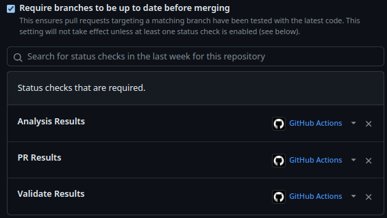
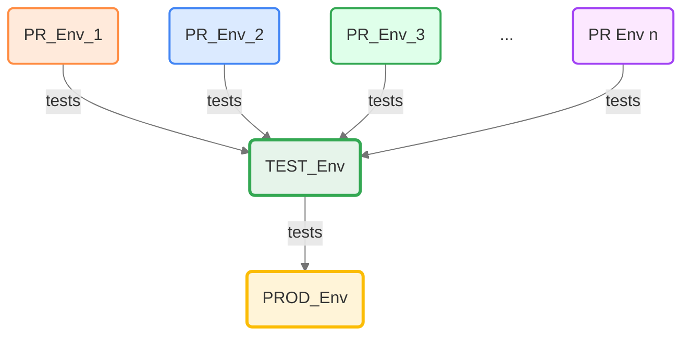
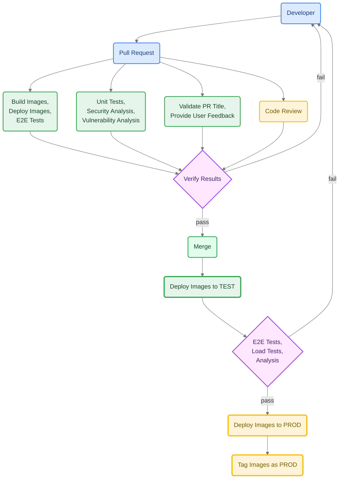
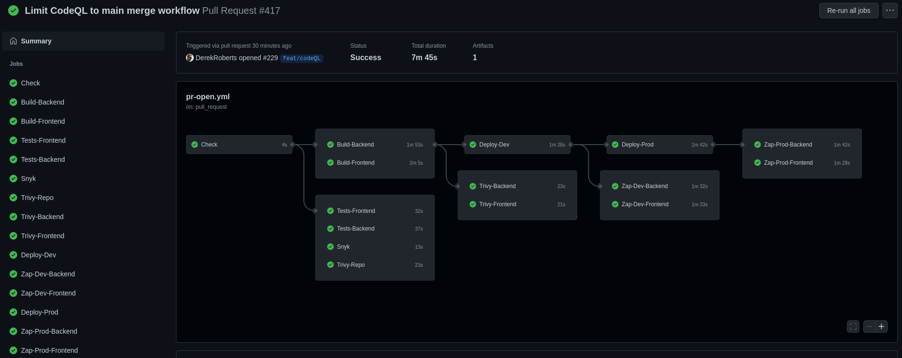
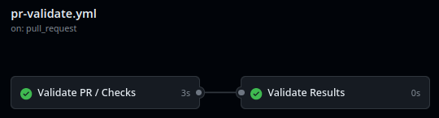
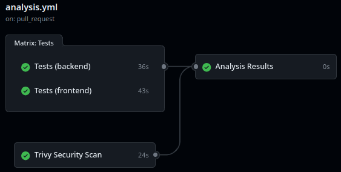
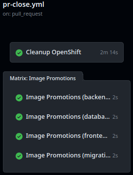
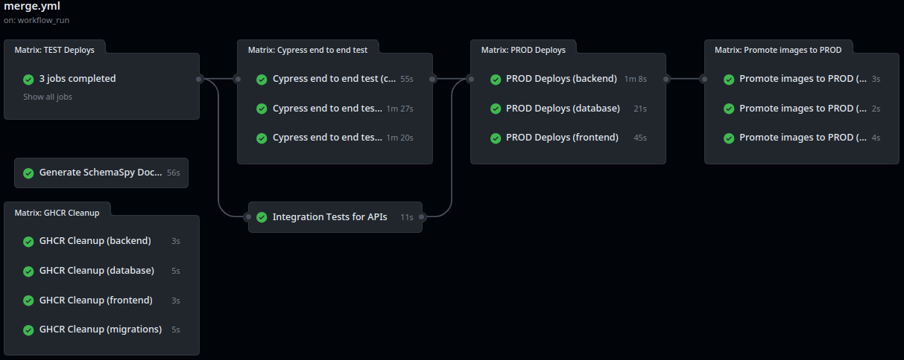
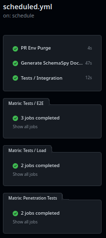
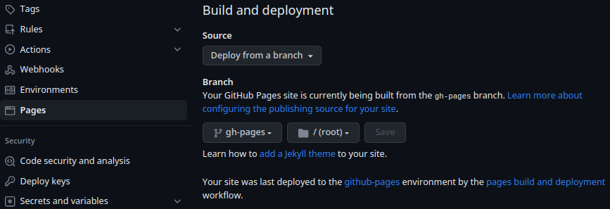

[](/LICENSE)
[](https://github.com/bcgov/repomountie/blob/master/doc/lifecycle-badges.md)
[](https://github.com/bcgov/quickstart-openshift/actions/workflows/merge.yml)
[](https://github.com/bcgov/quickstart-openshift/actions/workflows/analysis.yml)
[](https://github.com/bcgov/quickstart-openshift/actions/workflows/scheduled.yml)

# QuickStart for OpenShift

## Pull Request-Based Workflows with Sample Stack

This repository provides a template to rapidly deploy a modern web application stack to the BC Government's OpenShift platform using [GitHub Actions](https://github.com/bcgov/quickstart-openshift/actions), incorporating best practices for CI/CD, security, and observability.  By hitting the ground running we can save weeks-to-months of development time plus receive regular updates and features.

Includes:
* Pull Request-based pipeline
* Sandboxed development environments
* Gated/controlled production deployments (optional)
* Container publishing (ghcr.io) and importing (OpenShift)
* Security, vulnerability, infrastructure, and container scan tools
* Automatic dependency patching available from [bcgov/renovate-config](https://github.com/bcgov/renovate-config)
* Enforced code reviews and workflow jobs (pass|fail)
* Helm Package Manager
* Prometheus Metrics export from Backend/Frontend
* Resource Tuning with Horizontal Pod Autoscaler (TEST/PROD only)
* Affinity and anti-affinity for Scheduling on different worker nodes
* Rolling updates with zero downtime in PROD
* Database Migrations with Flyway
* Pod disruption budgets for high availability
* Self-healing through probes/checks (startup, readiness, liveness)
* Point the long-lived DEMO route to PRs by using the `demo` label
* Sample application stack:
    * Database: Crunchy (Postgres, PostGIS), backups, Flyway
    * Frontend: TypeScript, Caddy Server
    * Backend: TypeScript, Nest.js
    * Alternative backend examples - see [Alternative Backends](#alternative-backends)

# Setup

Initial setup is intended to take an hour or less.  This depends greatly on intended complexity, features selected/excluded and outside cooperation.

## Prerequisites

The following are required:

- [ ] BC Government IDIR accounts for anyone submitting requests
- [ ] [GitHub accounts](https://github.com/signup) for all participating team members
- [ ] Membership in the BCGov GitHub organization
    - Join the bcgov organization using [these instructions](https://developer.gov.bc.ca/docs/default/component/bc-developer-guide/use-github-in-bcgov/bc-government-organizations-in-github/#directions-to-sign-up-and-link-your-account-for-bcgov).
- [ ] OpenShift project namespaces:
    - [BCGov signup](https://registry.developer.gov.bc.ca)

## Using this Template

Create a new repository using this repository as a template.

* Verify bcgov/quickstart-openshift is selected under Repository template


## Secrets, Variables and Environments

### Secrets and Variables

Variables and secrets are consumed by workflows.  Variables are visible in workflows and logs, while secrets are hidden/redacted.

To create new secrets from GitHub.com click:

* `Settings > Secrets and Variables > Actions > Secrets > New repository secret`

Note: Dependabot, which we don't recommend as highly as Renovate, requires its own set of values.

### Environments

Environments are groups of secrets and variables with optional access controls.  This includes limiting access to certain users or requiring manual approval before a requesting workflow can run.  Environment values add to or override any common (environment-free) values.

To create new environments from GitHub.com click:

* `Settings > Environments > New environment`

Environments provide a [number of features](https://docs.github.com/en/actions/deployment/targeting-different-environments/using-environments-for-deployment), including:

* Required reviewers
* Wait timer
* Limit TEST/PROD values to post-merge workflows

### Example

Here is the arrangement of secrets, variables and environments for this repository.

| Environment | Name                   | Description           |
|-------------|------------------------|-----------------------|
| \<none\>    | `vars.OC_SERVER`       | Common server address |
| \<none\>    | `vars.MSTEAMS_WEBHOOK` | Common alert webhook  |
| \<none\>    | `secrets.OC_NAMESPACE` | DEV namespace         |
| \<none\>    | `secrets.OC_TOKEN`     | DEV service token     |
| TEST        | `secrets.OC_NAMESPACE` | TEST namespace        |
| TEST        | `secrets.OC_TOKEN`     | TEST service token    |
| PROD        | `secrets.OC_NAMESPACE` | PROD namespace        |
| PROD        | `secrets.OC_TOKEN`     | PROD service token    |

### Secret Values

**`OC_TOKEN`**

OpenShift's service account token, different for every namespace.  This guide assumes your OpenShift platform team has provisioned a pipeline account.

* Consume: `{{ secrets.OC_TOKEN }}`

Locate an OpenShift pipeline token:

1. Login to your OpenShift cluster, e.g.: [Gold](https://console.apps.gold.devops.gov.bc.ca/) or [Silver](https://console.apps.silver.devops.gov.bc.ca/)
2. Select your DEV namespace
3. Click Workloads > Secrets (under Workloads for Administrator view)
4. Select `pipeline-token-...` or a similarly privileged token
5. Under Data, copy `token`
6. Paste into the GitHub Secret `OC_TOKEN`

**`OC_NAMESPACE`**

Teams will receive a set of project namespaces, usually DEV (for PRs), TEST and PROD.  TOOLS namespaces (e.g. Jenkins, shared Oracle resources) are not used here.  Provided by your OpenShift platform team.

* Consume: `{{ secrets.OC_NAMESPACE }}`
* E.g.: `abc123-dev`

**`SONAR_TOKEN(s)`**

If SonarCloud is being used each application will have its own token.  Single-application repositories typically use `${{ secrets.SONAR_TOKEN }}`, while monorepos use similar names.

E.g.:
* `${{ secrets.SONAR_TOKEN_BACKEND }}`
* `${{ secrets.SONAR_TOKEN_FRONTEND }}`

BC Government employees can request SonarCloud projects by creating an [issue](https://github.com/BCDevOps/devops-requests/issues/new/choose) with BCDevOps.  Please make sure to request a monorepo with component names (e.g. backend, frontend), which may not be explained in their directions.

### Variable Values

> Click Settings > Secrets and Variables > Actions > Variables > New repository variable

**`OC_SERVER`**

OpenShift server address.
* Consume: `{{ vars.OC_SERVER }}`
* Value: `https://api.gold.devops.gov.bc.ca:6443` or `https://api.silver.devops.gov.bc.ca:6443`

**`MSTEAMS_WEBHOOK`**
* Consume: `{{ vars.MSTEAMS_WEBHOOK }}`
* Value: See MS Teams documentation for [webhooks](https://learn.microsoft.com/en-us/microsoftteams/platform/webhooks-and-connectors/how-to/add-incoming-webhook?tabs=newteams%2Cdotnet) and [message cards](https://learn.microsoft.com/en-us/outlook/actionable-messages/message-card-reference)


## Updating Dependencies

Dependabot and Mend Renovate can both provide dependency updates using pull requests.  Dependabot is simpler to configure, while Renovate is much more configurable and lighter on resources.

### Renovate

A config file (`renovate.json`) is included with this template.  It can source config from our [renovate repository](https://github.com/bcgov/renovate-config).  Renovate can be [self-hosted](https://github.com/renovatebot/github-action) or run using the GitHub App managed at the organization level.  For BC Government the OCIO controls this application, so please opt in with them using a GitHub issue.

To opt-in:
* Visit the [Renovate GitHub App](https://github.com/apps/renovate/)
* Click `Configure` and set up your repository
* Visit [BCDevOps Requests](https://github.com/BCDevOps/devops-requests)
* Select [Issues](https://github.com/BCDevOps/devops-requests/issues)
* Select [New Issue](https://github.com/BCDevOps/devops-requests/issues/new/choose)
* Select [Request for integrating a GitHub App](https://github.com/BCDevOps/devops-requests/issues/new?assignees=MonicaG%2C+oomIRL%2C+SHIHO-I&labels=github-app%2C+pending&projects=&template=github_integration_request.md&title=)
* Create a meaningful title, e.g. `Request to add X repo to Renovate App`
* Fill out the description providing a repository name
* Select "Submit new issue"
* Wait for Renovate to start sending pull requests to your repository

### Dependabot

Dependabot is no longer recommended as an alternative to Renovate for generating security, vulnerability and dependency pull requests.  It can still be used to generate warnings under the GitHub Security tab, which is only viewable by repository administrators.

## Repository Configuration

### Pull Request Handling

Squash merging is recommended for simplified history and ease of rollback.  Cleaning up merged branches is recommended for your DevOps Specialist's fragile sanity.

> Click Settings > General (selected automatically)

Pull Requests:

* `[uncheck] Allow merge commits`
* `[check] Allow squash merging`
   * `Default to pull request title`
* `[uncheck] Allow rebase merging`
* `[check] Always suggest updating pull request branches`
* `[uncheck] Allow auto-merge`
* `[check] Automatically delete head branches`

### Packages

Packages are available from your repository (link on right).  All should have visibility set to public for the workflows to run successfully.

E.g. https://github.com/bcgov/quickstart-openshift/packages

### Branch Protection Rules

This is required to prevent direct pushes and merges to the default branch.  These steps must be run after one full pull request pipeline has been run to populate the required status checks.

1. Select `Settings` (gear, top right) > `Rules` > `Rulesets` (under Code and Automation)
2. Click `New ruleset` > `New branch ruleset`
3. Setup Ruleset:
    * Ruleset Name: `main`
    * Enforcement status: `Active`
    * Bypass list:
        * Click `+ Add bypass`
        * Check `[x] Repository admin`
        * Click `Add selected`
    * Target branches:
        * Click `Add target`
        * Select `Add default branch`
    * Branch protections:
        * `[x] Restrict deletions`
        * `[x] Require linear history`
        * `[x] Require a pull request before merging`
            * Additional settings:
                * `Require approvals: 1` (or more!)
                * `[x] Require conversation resolution before merging`
        * `[x] Require status checks to pass`
            * `[x] Require branches to be up to date before merging`
            * Required checks: *These will be populated after a full pull request pipeline run!*
                * Click `+Add checks`
                * This is our default set, yours may differ:
                    * `Analysis Results`
                    * `PR Results`
                    * `Validate Results`
    * `[x] Block force pushes`
    * `[x] Require code scanning results`
        * Click `+ Add tool`
        * This is our default set, yours may differ:
            * `CodeQL`
            * `Trivy`
    * Click `Create`

Note: Required status checks will only be available to select after the relevant workflows have run at least once on a pull request.

#### Status checks example


#### Required tools and alerts example


### Adding Team Members

Don't forget to add your team members!  

1. Select Settings (gear, top right)  *> Collaborators and teams (under `Access`)
2. Click `Add people` or `Add teams`
3. Use the search box to find people or teams
4. Choose a role (read, triage, write, maintain, admin)
5. Click Add

# Workflows

These workflows and actions enforce a pull request based flow.


Here's a more detailed view showing a single pull request.



## Pull Request

Runs on pull request submission.

* Provides safe, sandboxed deployment environments
* Build action pushes to GitHub Container Registry (ghcr.io)
* Build triggers select new builds vs reusing builds
* Deploy only when changes are made
* Deployment includes curl checks and optional penetration tests
* Run tests (e2e, load, integration) when changes are made
* Other checks and updates as required



## Validation

Runs on pull request submission.

* Enforces conventional commits in PR title
* Adds greetings/directions to PR descriptions




## Analysis

Runs on pull request submission or merge to the default branch.

* Unit tests (should include coverage)
* CodeQL/GitHub security reporting (now handled as GitHub default!)
* Trivy password, vulnerability and security scanning



## Pull Request Closed

Runs on pull request close or merge.

* Cleans up OpenShift objects/artifacts
* Merge retags successful build images as `latest`



## Merge

Runs on merge to main branch.

* Code scanning and reporting to GitHub Security overview
* Zero-downtime* TEST deployment
* Penetration tests on TEST deployment (optional)
* Zero-downtime* PROD deployment
* Labels successful deployment images as PROD

\* excludes database changes



## Scheduled

Runs on scheduled job (cronjob) or workflow dispatch.

* PR environment purge
* Generate SchemaSpy documentation
* Tests (e2e, load, integration) on TEST deployment



## DEMO Routing

There is a long-lived custom route available to be assigned to specific Pull Request deployments.  Add the label `demo` to that pull request or run the `DEMO Route` workflow.

Typical route: `https://<REPO_NAME>-demo.apps.silver.devops.gov.bc.ca`

#### PR Label

Please note that the label must be manually created using GitHub's web interface.


#### Workflow


# App Stack

Frontend (JavaScript/TypeScript)

[](https://sonarcloud.io/summary/new_code?id=quickstart-openshift_frontend)
[](https://sonarcloud.io/summary/new_code?id=quickstart-openshift_frontend)
[](https://sonarcloud.io/summary/new_code?id=quickstart-openshift_frontend)
[](https://sonarcloud.io/summary/new_code?id=quickstart-openshift_frontend)
[](https://sonarcloud.io/summary/new_code?id=quickstart-openshift_frontend)
[](https://sonarcloud.io/summary/new_code?id=quickstart-openshift_frontend)
[](https://sonarcloud.io/summary/new_code?id=quickstart-openshift_frontend)
[](https://sonarcloud.io/summary/new_code?id=quickstart-openshift_frontend)
[](https://sonarcloud.io/summary/new_code?id=quickstart-openshift_frontend)

Backend (JavaScript/TypeScript)

[](https://sonarcloud.io/summary/new_code?id=quickstart-openshift_backend)
[](https://sonarcloud.io/summary/new_code?id=quickstart-openshift_backend)
[](https://sonarcloud.io/summary/new_code?id=quickstart-openshift_backend)
[](https://sonarcloud.io/summary/new_code?id=quickstart-openshift_backend)
[](https://sonarcloud.io/summary/new_code?id=quickstart-openshift_backend)
[](https://sonarcloud.io/summary/new_code?id=quickstart-openshift_backend)
[](https://sonarcloud.io/summary/new_code?id=quickstart-openshift_backend)
[](https://sonarcloud.io/summary/new_code?id=quickstart-openshift_backend)
[](https://sonarcloud.io/summary/new_code?id=quickstart-openshift_backend)

## Starter

The starter stack includes a frontend (React, Bootstrap, Vite, Caddy), backend (Nest/Node) and Postgres or PostGIS database.  See subfolder for source, including Dockerfiles and OpenShift templates.  Alternative backends are available.

Features:
* [TypeScript](https://www.typescriptlang.org/) strong-typing for JavaScript
* [NestJS](https://docs.nestjs.com) Nest/Node backend and frontend
* [Flyway](https://flywaydb.org/) database migrations
* [Crunchy](https://www.crunchydata.com/products/crunchy-postgresql-for-kubernetes) Postgres/PostGIS Database

PostGIS is enabled by default for geospatial data support when postGISVersion value is provided. To switch to standard PostgreSQL, update the `postGISVersion` field in the [Crunchy Helm chart values](./charts/crunchy/values.yml) to `~`. This disables PostGIS extensions, making it a plain PostgreSQL setup.

```yaml
# Example: Switching to PostgreSQL
postGISVersion: ~
```

## Crunchy Database

Crunchy is the default choice for high availability (HA) Postgres/PostGIS databases in BC Government.

### Key Features
- Automatic failover with Patroni
- Scheduled backups
- Monitoring
- Self-healing capabilities
- Horizontal scaling options (Read Replicas)

### Setup Tips
1. **Resource Allocation**: Adjust the resources in [crunchy helm chart values](charts/crunchy/values.yml) based on your application needs
2. **Environment Configuration**: Create environment-specific configs from base values.yml as  `values-test.yml` and `values-prod.yml`

### Enabling S3 Backups
To enable S3 backups/recovery, provide these parameters to the GitHub Action:
- `s3_access_key`
- `s3_secret_key` 
- `s3_bucket`
- `s3_endpoint`

> **Important**: Never reuse the same s3/object store, bucket path across different Crunchy deployments or instances (dev, test, prod)

For advanced configuration, see the [re-usable GitHub Action](https://github.com/bcgov/action-crunchy) that manages PR deployments and helm template upgrades.

### Troubleshooting and Support

If you encounter issues, check out the [Troubleshooting Guide](https://github.com/bcgov/crunchy-postgres/blob/main/Troubleshoot.md) for quick solutions.

Need more help? Join the discussion in the [CrunchyDB Rocket.Chat Channel](https://chat.developer.gov.bc.ca/channel/crunchydb) to get support from the community and experts.


## Alternative Backends

The sample Java, Python and Go backends repository has been archived, but we have lots of other great examples of active projects you can learn from!

* [NR-RFC-AlertAuthoring - Python with FastAPI and Alembic](https://github.com/bcgov/nr-rfc-alertauthoring)
* [QuickStart OpenShift Backends](https://github.com/bcgov/quickstart-openshift-backends)

## SchemaSpy

The database documentation is created and deployed to GitHub pages.  See [here](https://bcgov.github.io/quickstart-openshift/schemaspy/index.html).

After a full workflow run and merge can been run, please do the following:

1. Select Settings (gear, top right)  *> Pages (under `Code and automation`)
2. Click `Branch` or `Add teams`
3. Select `gh-pages`
4. Click `Save`



# Flyway, Prisma, Migrations
1. [Flyway is used as Database Schema Migration tool](https://www.red-gate.com/products/flyway/community/)
2. [Prisma is used as ORM layer](https://www.prisma.io/)
3. The rationale behind using flyway to have schema first approach and let prisma generate ORM schema from the database, which would avoid pitfalls like lazy loading, cascading, etc. when defining entities in ORM manually.
4. Run flyway in the docker compose to apply latest changes to Postgres database.
5. Run npx prisma db pull from backend folder to sync the prisma schema.
6. Run npx prisma generate to generate the prisma client which will have all the entities populated based on fresh prisma schema.
7. If using VS Code, be aware of [this issue](https://stackoverflow.com/questions/65663292/prisma-schema-not-updating-properly-after-adding-new-fields)

# Resources

This repository is provided by NRIDS Architecture and Forestry Digital Services, courtesy of the Government of British Columbia.

* NRID's [Kickstarter Guide](https://bcgov.github.io/nr-architecture-patterns-library/docs/Agile%20Team%20Kickstarter) (via. Confluence, links may be internal)

# [How Tos](./HOWTO.md)
## Architecture

The architecture diagram provides an overview of the system's components, their interactions, and the deployment structure. It illustrates the relationships between the frontend, backend, database, and other infrastructure elements within the OpenShift environment.


# Contributing

Please contribute your ideas!  [Issues](/../../issues) and [Pull Requests](/../../pulls) are appreciated.
