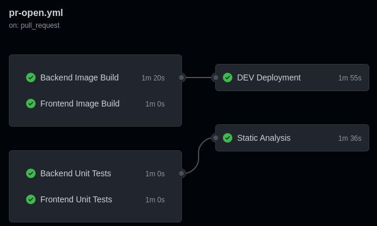
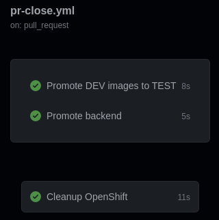
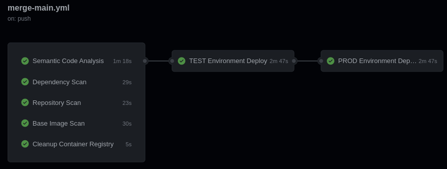
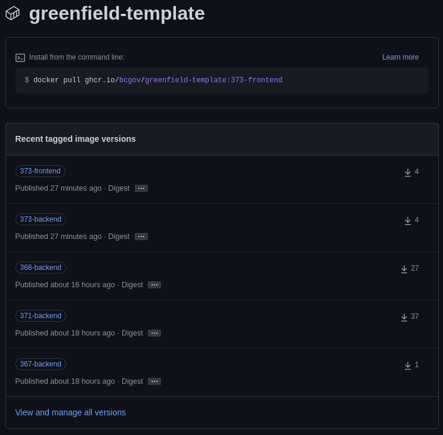
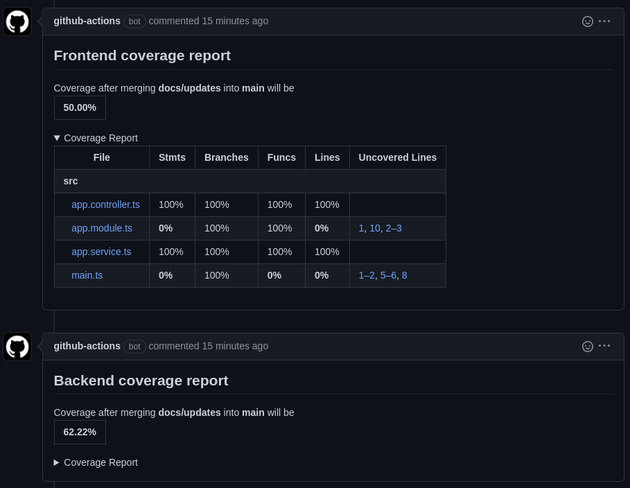
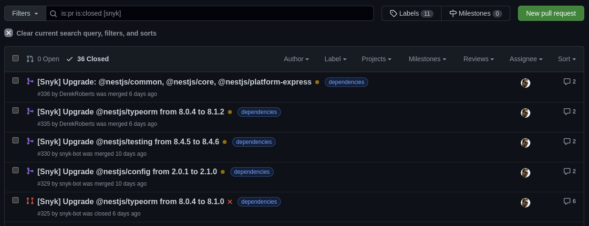
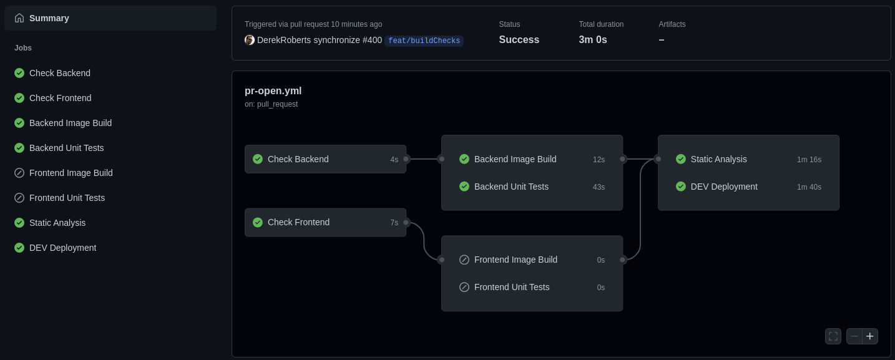
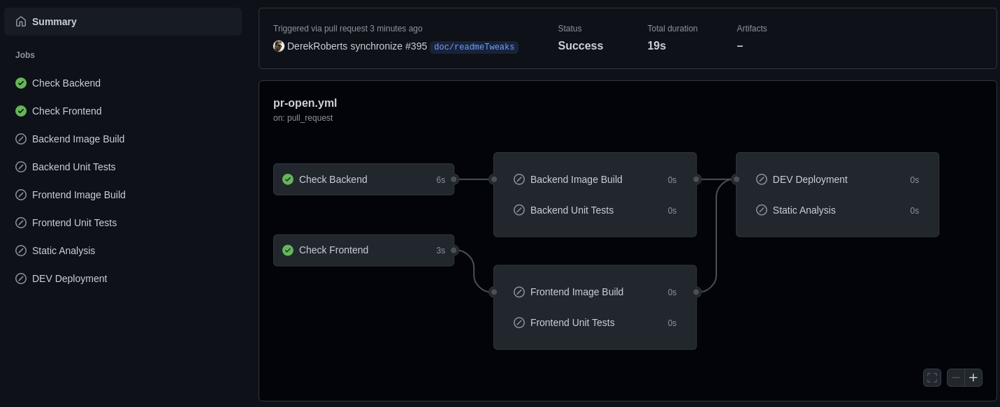
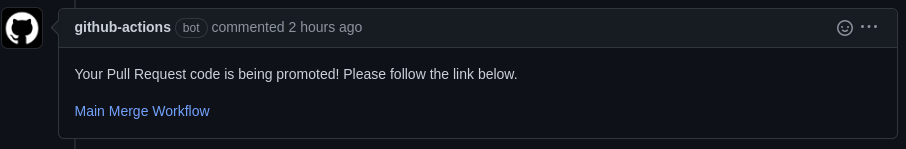

<!-- PROJECT SHIELDS -->

# DevOps QuickStart (formerly Greenfield Template)

Courtesy of the Forestry Suite of Applications Program from the Ministry of Land, Water and Resource Stewardship.

UPDATE: We are of splitting this offering into a quickstart template and helper functions.  Please be on the lookout for progress, releases and new features! 

## Getting Started

Initial configuration is expected to take under three hours.  Please read [our setup guide](./SETUP.md) to get started.

## Overview

The DevOps Quickstart is a fully functional set of pipeline workflows and a starter application stack intended to help Agile DevOps teams hit the ground running.  Currently OpenShift is supported with plans for AWS (Amazon Web Services).  Pipelines are run using [GitHub Actions](https://github.com/bcgov/devops-quickstart/actions).

Features:
* Pull Request-based pipeline
* Sandboxed development deployments
* Gated production deployments
* Container publishing (ghcr.io) and importing (OpenShift)
* Security, vulnerability, infrastructure and container scan tools
* Automatic dependency patching with Pull Requests
* Enforced code reviews and pipeline checks
* Templates and setup documentation
* Starter TypeScript application stack

This project is in active development.  Please visit our [issues](https://github.com/bcgov/devops-quickstart/issues) page to view or request features.

### Workflow 1 of 3: PR Open

### Workflow 2 of 3: PR Close

### Workflow 3 of 3: Main Merge

### Deployments

Out-of-the-box, sandboxed, pull request-based development deployments allowing for multiple developers to work on and see their features at once.

Deployment to production is gatekept using GitHub environments, requiring sign off from code maintainers.

Deployment to test, staging or pre-prod (pick a name!) is currently planned to be transitory, allowing access to gatekept data, but only stopping before production deployment if a failure occurs.  (work in progress)

Successful deployments are linked in Pull Request comments.

### Builds

Builds are handled by Docker Actions and published to the GitHub Container Registry (ghcr.io).  This allows for publicly accessible builds that can be consumed by OpenShift, Amazon Web Services or any other container service.

### Testing

Unit tests are run in jest, but other test frameworks can always be installed.  SonarCube should be configured to pick up sarif files and provide coverage reports.

### Code Quality

Code quality is reporting are performed by:

* SonarCloud
* CodeQL

Sonar reports are provided as Pull Request comments.

### Code Coverage

Code coverage is generated by any included tests.  Results are provided as Pull Request comments.

### Security Scanning

Dependency, container and vulnerability scanning is performed by:

* Trivy
* Snyk

### Penetration Testing

Penetration testing and reporting is performed by:

* OWASP ZAP

### Dependency Management

Dependency scanning, patching and updating by PR is performed by:

* Snyk

### Higher-Level Environments

Higher-level environments come after DEV deployments and are usually called any of TEST, STAGING, PRE-PROD or PROD.  Since data and token access is more frequently sensitive access must be controlled by only allowing access from a merge to the main branch.

### Higher-Level Environment Gatekeeping

Optionally, higher-level deployments can be prevented until manually approved.

## Workflows

### 1: Pull Request Opened/Modified

This workflow is triggered when a Pull Request to the main branch is created or modified.  Each development deployment is separate, using its own stack.  This avoids collisions between development environments and provides isolation for testing and experimentation.  Pipeline steps are enforced, preventing merge of failing code.

The workflow, located [here](https://github.com/bcgov/devops-quickstart/blob/main/.github/workflows/pr-open.yml), includes:

* [Pull Request](https://github.com/bcgov/devops-quickstart/pulls)-based ephemeral, sandboxed environments
* [Docker](https://github.com/marketplace/actions/build-and-push-docker-images)/[Podman](https://podman.io) container building
* [Build caching](https://github.com/marketplace/actions/cache) to save time and bandwidth
* [GitHub Container Registry](https://github.com/bcgov/devops-quickstart/pkgs/container/devops-quickstart) image publishing
* [RedHat OpenShift](https://www.redhat.com/en/technologies/cloud-computing/openshift) deployment, with other options under consideration
* [Jest](https://jestjs.io/) JavaScript testing enforced in-pipeline
* [SonarCloud](https://sonarcloud.io/) static analysis test coverage reporting

Triggers are used to determine whether images need to be built or previous ones consumed.  Partial or full skips, like when limited to documentation, are shown below.

When a PR is merged, the message comment below is added.  Despite showing on this pull request it is actually handled by the next pipeline.

### 2: Pull Request Close Pipeline

The workflow, located [here](https://github.com/bcgov/devops-quickstart/blob/main/.github/workflows/pr-close.yml), fires when a pull request is closed.

* ghcr.io cleanup of dev images over 14 days-old
* OpenShift dev artifact removal

When a pull request is merged to main, one additional job is run.  This promotes the new images to the TEST environment.

* Image promotion to higher-level environments

If this closure was triggered by a merge to the main branch it will trigger the following workflow.

### 3: Pull Request Main Merge Pipeline

The workflow, located [here](https://github.com/bcgov/devops-quickstart/blob/main/.github/workflows/merge-main.yml), includes:

* [GitHub CodeQL](https://codeql.github.com/) semantic code analysis and vulerability scanning
* [OWASP ZAP](https://www.zaproxy.org/) Zed Attack Proxy web app penetration testing
* [SonarCloud](https://sonarcloud.io/) static analysis for continuous code quality and security scanning
* [Snyk](https://snyk.io/) vulnerability scanning and PR-based dependency patching
* [Tryvy](https://aquasecurity.github.io/trivy) repository and base image scanning
* Higher-level deployments (e.g. TEST, STAGING, PRE-PROD, PROD)
* Publishing of production images to the GitHub Container Registry (ghcr.io)

## Starter Application

The starter stack includes a frontend, backend and postgres database.  The frontend and backend are buld with [NestJS](https://docs.nestjs.com).  They currently do very little, but provide placeholders for more functional products.  See the backend and frontend folders for source, including Dockerfiles.

Features:
* [TypeScript](https://www.typescriptlang.org/) strong-typing for JavaScript
* [NestJS](https://docs.nestjs.com) frontend and backend
* [ESLint](https://eslint.org/) linting enforced on code staging (currently disabled)
* [Postgres](https://www.postgresql.org/) database

Local development can be supported using Docker Compose.  Please be aware that Podman and Podman Compose work as drop-in replacements for the Docker counterparts.

`docker-compose up -d`

### Example APIs, UIs and Metabase/Oracle Templates

Templates for APIs, UIs and Metabase/Oracle can be used to kickstart or extend projects.  Please visit our collaborators' [NR Architecture Templates](https://github.com/bcgov/nr-arch-templates) repository for more information.
