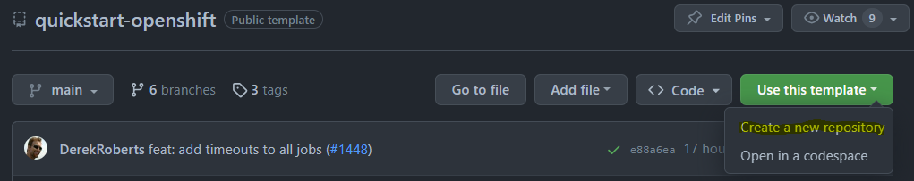
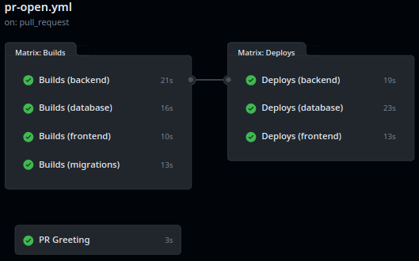

##### Frontend (JavaScript/TypeScript)

##### Backend (JavaScript/TypeScript)

# QuickStart for OpenShift

## Pull Request-Based Workflows with Sample Stack

The is a fully functional set of [GitHub Actions](https://github.com/bcgov/quickstart-openshift/actions) workflows and a starter application stack intended to help Agile teams hit the ground running.

Features:
* Pull Request-based pipeline
* Sandboxed development environments
* Gateable production deployments
* Container publishing (ghcr.io) and importing (OpenShift)
* Security, vulnerability, infrastructure, and container scan tools
* Automatic dependency patching available from [bcgov/nr-renovate](https://github.com/bcgov/nr-renovate)
* Enforced code reviews and workflow jobs (pass|fail)
* Helm Package Manager for atomic deployments
* Sample application stack:
    * Database: Postgres, PostGIS, backups
    * Frontend: TypeScript, Caddy Server
    * Backend: TypeScript, Nest.js
    * Alternative backends for [Java/Quarkus, Go/Fiber and Python/FastAPI](https://github.com/bcgov/quickstart-openshift-backends)

# Table of Contents

* [Setup](#Setup)
  * [Prerequisites](#Prerequisites)
  * [Using this Template](#Using-this-Template)
  * [Secrets and Variables](#Secrets-and-Variables)
  * [Environments](#environments)
  * [Updating Dependencies](#Updating-Dependencies)
  * [Repository Configuration](#Repository-Configuration)
* [Workflows](#Workflows)
  * [Pull Request](#Pull-Request)
  * [Analysis](#Analysis)
  * [Pull Request Closed](#Pull-Request-Closed)
  * [Merge](#Merge)
* [App Stack](#App-Stack)
  * [Starter](#Starter)
  * [Pluggable Backends](#Pluggable-Backends)
  * [SchemaSpy](#SchemaSpy)
* [Resources](#Resources)
* [Contributing](#Contributing)

# Setup

Initial setup is intended to take an hour or less.  This depends greatly on intended complexity, features selected/excluded and outside cooperation.

## Prerequisites

The following are required:

* BC Government IDIR accounts for anyone submitting requests
* GitHub accounts for all participating team members
    * [Sign Up is free](https://github.com/signup)
* Membership in the BCGov GitHub organization
    * Provide GitHub IDs to [BCGov's Just Ask](https://just-ask.developer.gov.bc.ca/)
* Project namespaces:
    * OpenShift  * [Register a New Project](https://registry.developer.gov.bc.ca)

## Using this Template

Create a new repository using this repository as a template.

* Select bcgov/quickstart-openshift under Repository template
* Check Codecov | Code Coverage to grant access

## Secrets and Variables

Variables and secrets are consumed by workflows.  Environments provide their own values, overriding default sets.

Secrets are hidden from logs and outputs, while variables are visible.  Using secrets exclusively can make troubeshooting more difficult.

Note: Dependabot, which we don't recommend as highly as Renovate, requires its own set of variables.

### Secrets Values

> Click Settings > Secrets and Variables > Actions > Secrets > New repository secret

**GITHUB_TOKEN**

Default token.  Replaced every workflow run, available to all workflows.
* Consume: `{{ secrets.GITHUB_TOKEN }}`

**OC_TOKEN**

OpenShift token, different for every project/namespace.  This guide assumes your OpenShift platform team has provisioned a pipeline account.

* Consume: `{{ secrets.OC_TOKEN }}`

Locate an OpenShift pipeline token:

1. Login to your OpenShift cluster, e.g.: [Gold](https://console.apps.silver.devops.gov.bc.ca/) or [Silver](https://console.apps.silver.devops.gov.bc.ca/)
2. Select your DEV namespace
3. Click Workloads > Secrets (under Workloads for Administrator view)
4. Select `pipeline-token-...` or a similarly privileged token
5. Under Data, copy `token`
6. Paste into the GitHub Secret `OC_TOKEN`

**SONAR_TOKEN(s)**

If SonarCloud is being used each application will have its own token.  Single-application repositories typically use `${{ secrets.SONAR_TOKEN }}`, while monorepos use multiple, e.g. `${{ secrets.SONAR_TOKEN_BACKEND }}`, `${{ secrets.SONAR_TOKEN_FRONTEND }}`.

BC Government employees can request SonarCloud projects by creating an [issue](https://github.com/BCDevOps/devops-requests/issues/new/choose) with BCDevOps.  Please make sure to request a monorepo with component names (e.g. backend, frontend), which may not be explained in their directions.

### Variable Values

> Click Settings > Secrets and Variables > Actions > Variables > New repository variable

**OC_SERVER**

OpenShift server address.
* Consume: `{{ vars.OC_SERVER }}`
* Value: `https://api.gold.devops.gov.bc.ca:6443` or `https://api.silver.devops.gov.bc.ca:6443`

**OC_NAMESPACE**

OpenShift project/namespace.  Provided by your OpenShift platform team.

* Consume: `{{ vars.OC_NAMESPACE }}`
* Value: format `abc123-dev | test | prod`

## Environments

Environments are groups of secrets and variables that can be gatekept.  This includes limting access to certain users or requiring manual approval before a requesting workflow can run.  Environment values override any default values.

For pull requests and development surrounding lower-level, sandboxed environments it is best not to use an environment at all.  Higher level environments, like TEST and PROD, will override those values as necessary.

> Click Settings > Environments > New environment

Environments provide a [number of features](https://docs.github.com/en/actions/deployment/targeting-different-environments/using-environments-for-deployment), including:

* Required reviewers
* Wait timer
* Deployment branches

## Updating Dependencies

Dependabot and Mend Renovate can both provide dependency updates using pull requests.  Dependabot is simpler to configure, while Renovate is much more configurable and lighter on resources.

### Self-Hosted Renovate

Renovate is provided by DevOps at the Natural Resources.  Support is best effort.  It is our recommended path, due to being highly configurable and light on resources.

To opt-in:
 * Provide our bot, `bcgov-renovate`, write access to a repository
 * Sign up with us by [pick one]:
    * Add your repository to our [list](https://github.com/bcgov/nr-renovate/blob/main/renovate.json#L21) using a pull request
    * OR write us [an issue](https://github.com/bcgov/nr-renovate/issues/new/choose) providing your repository name

### Dependabot

Dependabot is configurable from the following file.  More information is available [here](https://docs.github.com/en/code-security/dependabot/working-with-dependabot/keeping-your-actions-up-to-date-with-dependabot).

Please be aware that Dependabot requires its own set of secrets to be configured.  Navigation:

> Click Settings > Secrets and Variables > Actions > Variables > New repository variable

## Repository Configuration

### Pull Request Handling

Squash merging is recommended for simplified history and ease of rollback.  Cleaning up merged branches is recommended for your DevOps Specialist's fragile sanity.

> Click Settings > General (selected automatically)

Pull Requests:

* `[uncheck] Allow merge commits`
* `[check] Allow squash merging`
   * `Default to pull request title`
* `[uncheck] Allow rebase merging`
* `[check] Always suggest updating pull request branches`
* `[uncheck] Allow auto-merge`
* `[check] Automatically delete head branches`

### Packages

Packages are available from your repository (link on right).  All should have visibility set to public for the workflows to run successfully.

E.g. https://github.com/bcgov/quickstart-openshift/packages

### Branch Protection

This is required to prevent direct pushes and merges to the default branch.  These steps must be run after one full pull request pipeline has been run.

1. Select Settings (gear, top right)  *> Branches (under Code and Automation)
2. Click `Add Rule` or edit an existing rule
3. Under `Protect matching branches` specify the following:
    * Branch name pattern: `main`
    * `[check] Require a pull request before merging`
        * `[check] Require approvals` (default = 1)
        * `[check] Dismiss stale pull request approvals when new commits are pushed`
        * `[check] Require review from Code Owners`
    * `[check] Require status checks to pass before merging`
        * `[check] Require branches to be up to date before merging`
        * `Status checks that are required`:
            * Select checks as appropriate, e.g. Build x, Deploy y
    * `[check] Require conversation resolution before merging`
    * `[check] Include administrators` (optional)

### Adding Team Members

Don't forget to add your team members!  

1. Select Settings (gear, top right)  *> Collaborators and teams (under `Access`)
2. Click `Add people` or `Add teams`
3. Use the search box to find people or teams
4. Choose a role (read, triage, write, maintain, admin)
5. Click Add

# Workflows

## Pull Request

Runs on pull request submission.

* Provides safe, sandboxed deployment environments
* Build action pushes to GitHub Container Registry (ghcr.io)
* Build triggers select new builds vs reusing builds
* Deployment triggers to only deploy when changes are made
* Deployment includes curl checks and optional penetration tests
* Other checks and updates as required

## Analysis

Runs on pull request submission or merge to the default branch.

* Unit tests (should include coverage)
* SonarCloud coverage and analysis
* CodeQL/GitHub security reporting
* Trivy password, vulnerability and security scanning

## Pull Request Closed

Runs on pull request close or merge.

* Cleans up OpenShift objects/artifacts
* Merge promotes successful build images to TEST

## Merge

Runs on merge to main branch.

* Code scanning and reporting to GitHub Security overview
* Zero-downtime* TEST deployment
* Penetration tests on TEST deployment
* Zero-downtime* PROD deployment
* Labels successful deployment images as PROD

\* excludes database changes

# App Stack

## Starter

The starter stack includes a (React, MUI, Vite, Caddy) frontend, Pluggable backend(Nest/Node, Quarkus/Java On Native, FastAPI/Python, Fiber/Golang) and postgres database.  See subfolder for source, including Dockerfiles and OpenShift templates.

Features:
* [TypeScript](https://www.typescriptlang.org/) strong-typing for JavaScript
* [NestJS](https://docs.nestjs.com) Nest/Node backend and frontend
* [Flyway](https://flywaydb.org/) database migrations
* [Postgres](https://www.postgresql.org/) or [PostGIS](https://postgis.net/) database
* [backup-container](https://github.com/BCDevOps/backup-container) provided by BCDevOps

Postgres is default.  Switch to PostGIS by copying the appropriate Dockerfile to `./database`:

> cp ./database/postgis/Dockerfile ./database

## Pluggable Backends

This quickstart works with more than just JavaScript.  Please check out our pluggable [backends repository](https://github.com/bcgov/quickstart-openshift-backends).  Flyway-based database migrations for each are included.

Supported languages:
* [Go with Fiber](https://github.com/bcgov/quickstart-openshift-backends/tree/main/backend-go)
* [Java with Quarkus, Cloud Native](https://github.com/bcgov/quickstart-openshift-backends/tree/main/backend-go)
* [Python with FastAPI](https://github.com/bcgov/quickstart-openshift-backends/tree/main/backend-py)

## SchemaSpy

The database documentation is created and deployed to GitHub pages.  See [here](https://bcgov.github.io/quickstart-openshift/schemaspy/index.html).

After a full workflow run and merge can been run, please do the following:

1. Select Settings (gear, top right)  *> Pages (under `Code and automation`)
2. Click `Branch` or `Add teams`
3. Select `gh-pages`
4. Click `Save`

# Resources

This repository is provided by NRIDS Architecture and Forestry Digital Services, courtesy of the Government of British Columbia.

* NRID's [Kickstarter Guide](https://github.com/bcgov/nr-arch-templates/blob/main/confluence/pages/Agile_Team_Kickstarter/README.md) (via. Confluence, links may be internal)
* [OpenShift Backends for Go, Java and Python](https://github.com/bcgov/quickstart-openshift-backends)

# Contributing

Please contribute your ideas!  [Issues](/../../issues) and [Pull Requests](/../../pulls) are appreciated.
