[](/LICENSE)
[](https://github.com/bcgov/quickstart-openshift/actions/workflows/merge.yml)
[](https://github.com/bcgov/quickstart-openshift/actions/workflows/analysis.yml)
[](https://github.com/bcgov/quickstart-openshift/actions/workflows/scheduled.yml)

# QuickStart for OpenShift

## Pull Request-Based Workflows with Sample Stack

This repository provides a template to rapidly deploy a modern web application stack to OpenShift using [GitHub Actions](https://github.com/bcgov/quickstart-openshift/actions), incorporating best practices for CI/CD, security, and observability. By hitting the ground running we can save weeks‑to‑months of development time, receive regular updates, and built‑in **Maintenance Mode Automation**, which allows an app to go on autopilot for security and dependency updates.  This limits developmer involvement to critical issues only, drastically reducing labor costs and freeing up resources for higher priority work.

**Includes:**
* Pull Request-based pipeline
* Sandboxed development environments
* Gated/controlled production deployments (optional)
* Container publishing (ghcr.io) and importing (OpenShift)
* Security, vulnerability, infrastructure, and container scan tools
* Out-of-the-box alignment with **OWASP ASVS** Level 1 & 2 controls (see [SECURITY.md](file:///home/derek/Repos/quickstart-openshift/SECURITY.md#owasp-asvs-alignment))
* Automatic dependency patching via [bcgov/renovate-config](https://github.com/bcgov/renovate-config)
* Maintenance Mode Automation (hands‑off updates, low‑dev mode) via the same Renovate config
* Enforced code reviews and workflow jobs (pass|fail)
* OpenShift Templates
* Prometheus Metrics export from Backend/Frontend
* Resource Tuning with Horizontal Pod Autoscaler
* Affinity and anti-affinity for Scheduling on different worker nodes
* Rolling updates with zero downtime in PROD
* Database Migrations with Flyway
* Pod disruption budgets for high availability
* Self-healing through probes/checks (startup, readiness, liveness)
* **Sample application stack:**
    * Database: Postgres, Flyway
    * Frontend: TypeScript, Caddy Server with Coraza WAF
    * Backend: TypeScript, Nest.js


# Setup

Initial setup is intended to take an hour or less.  This depends greatly on intended complexity, features selected/excluded and outside cooperation.

## Prerequisites

The following are required for all users:

- [ ] [GitHub accounts](https://github.com/signup) for all participating team members
- [ ] An OpenShift cluster with project namespaces (DEV, TEST, PROD)

### Additional Requirements for BC Government OpenShift

If you're using BC Government's OpenShift platform, you'll also need:

- [ ] BC Government IDIR accounts for anyone submitting requests
- [ ] Membership in the BCGov GitHub organization
    - Join the bcgov organization using [these instructions](https://developer.gov.bc.ca/docs/default/component/bc-developer-guide/use-github-in-bcgov/bc-government-organizations-in-github/#directions-to-sign-up-and-link-your-account-for-bcgov).
- [ ] BCGov OpenShift project namespaces:
    - [BCGov signup](https://registry.developer.gov.bc.ca)

## Using this Template

Create a new repository using this repository as a template.

* Verify bcgov/quickstart-openshift is selected under Repository template

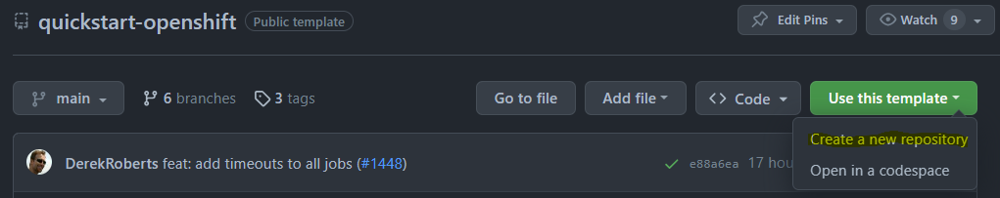

## Secrets, Variables and Environments

### Secrets and Variables

Variables and secrets are consumed by workflows.  Variables are visible in workflows and logs, while secrets are hidden/redacted.

**Repository-level vs Environment-specific:**

- **Repository-level** (shown as `<none>` in the environment column): These are available to all workflows and environments. They're created at the repository level and apply globally unless overridden by environment-specific values.
- **Environment-specific**: These are scoped to a particular environment (e.g., TEST, PROD) and override repository-level values when that environment is used.

To create new secrets from GitHub.com click:

* `Settings > Secrets and Variables > Actions > Secrets > New repository secret`

Note: Dependabot, which we don't recommend as highly as Renovate, requires its own set of values.

### Environments

Environments are groups of secrets and variables with optional access controls.  This includes limiting access to certain users or requiring manual approval before a requesting workflow can run.  Environment values add to or override any repository-level values.

To create new environments from GitHub.com click:

* `Settings > Environments > New environment`

Environments provide a [number of features](https://docs.github.com/en/actions/deployment/targeting-different-environments/using-environments-for-deployment), including:

* Required reviewers
* Wait timer
* Limit TEST/PROD values to post-merge workflows

### Example

Here is the arrangement of secrets, variables and environments for this repository.

| Environment | Name                   | Description                                     |
|-------------|------------------------|-------------------------------------------------|
| none        | `vars.oc_server`       | Common server address (repository-level)        |
| none        | `secrets.oc_namespace` | PR namespace (repository-level)                 |
| none        | `secrets.oc_token`     | PR service token (repository-level)             |
| none        | `secrets.db_password`  | PR database password (repository-level)         |
| test        | `secrets.oc_namespace` | TEST namespace (environment-level)              |
| test        | `secrets.oc_token`     | TEST service token (environment-level)          |
| test        | `secrets.db_password`  | TEST database password (environment-level)       |
| prod        | `secrets.oc_namespace` | PROD namespace (environment-level)              |
| prod        | `secrets.oc_token`     | PROD service token (environment-level)          |
| prod        | `secrets.db_password`  | PROD database password (environment-level)       |

### Secret Values

**`oc_token`** 

Create separate tokens for each of the DEV, TEST and PROD namespaces.  

1. Login to your OpenShift console, e.g. [Silver](https://console.apps.silver.devops.gov.bc.ca/) or [Gold](https://console.apps.gold.devops.gov.bc.ca/).
1. Select the pulldown with your username in the top right corner.
1. Select `Copy login command`.
1. Follow the UI to access a one-time login with token.
1. Paste the login command into a shell, e.g.:
    ```
    oc login --token=... --server=...
    ```
1. View available projects:
    ```
    oc projects
    ```
1. Switch to a namespace:
    ```
    oc project <abc123-name>
    ```
1. Create a service account:
    ```
    oc create sa github-actions
    ```
1. Create a role binding:
    ```
    oc create rolebinding github-actions-edit --clusterrole=edit --serviceaccount=$(oc project -q):github-actions
    ```
1. Create and copy a token.  It cannot be retrieved again:
    ```
    oc create token github-actions --duration=87600h
    ```

* Alternate steps using an inline template can be found [here](https://github.com/bcgov/gh-discussions-lab/discussions/3750). 
* In earlier versions of OpenShift, a pipeline token secret was created automatically in each namespace. 
* Reference: `${{ secrets.oc_token }}`

**`oc_namespace`** 

Teams will receive a set of project namespaces, usually DEV (for PRs), TEST and PROD.  TOOLS namespaces (e.g. Jenkins, shared Oracle resources) are not used here.  Provided by your OpenShift platform team.

* Reference: `${{ secrets.oc_namespace }}`
* E.g.: `abc123-dev`

**`SONAR_TOKEN(s)`** 

If SonarCloud is being used each application will have its own token.  Single-application repositories typically use `SONAR_TOKEN`, while monorepos append component names.

* Reference (standalone): `${{ secrets.SONAR_TOKEN }}`
* Reference (monorepo): `${{ secrets.SONAR_TOKEN_BACKEND }}`, `${{ secrets.SONAR_TOKEN_FRONTEND }}`, etc

BC Government employees can request SonarCloud projects by creating an [issue](https://github.com/bcgov/devops-requests/issues/new/choose) with the platform team.  Please make sure to request a monorepo with component names (e.g. backend, frontend), which may not be explained in their directions.

**db_password**

The password used for the PostgreSQL database. This **MUST** be a strong, unique password and **DISTINCT** across all environments (pr, test, prod). Reusing the same password in development/PRs as in production is a critical security risk.

* Reference: `${{ secrets.db_password }}`
* Minimum 12 characters recommended for production.
* **Pro-tip**: Use a password manager (like BitWarden, 1Password, or KeePass) to generate and store long, random, and unique passwords for each environment. Avoid simple, guessable passwords like `password` or `secure`.

**`SYSDIG_API_TOKEN`**

Sysdig API token used to sync the PROD email-alert set on every merge. Sourced from the in-cluster Secret materialized by your `SysdigTeam` CR (BC Gov platform-services provisions this in your `*-tools` namespace). Optional — if unset, the `monitor-prod` step no-ops with a warning, so the deploy still succeeds.

* Reference: `${{ secrets.SYSDIG_API_TOKEN }}`
* Alert templates live in [`monitoring/alerts/`](./monitoring/alerts/). Add or remove files to customize the alert set per app — see [`bcgov/action-sysdig-monitor`](https://github.com/bcgov/action-sysdig-monitor) for the template schema and placeholder vocabulary.

### Variable Values

>  Click Settings > Secrets and Variables > Actions > Variables > New repository variable

**`oc_server`** 

OpenShift server address (API endpoint for your OpenShift cluster).
* Reference: `${{ vars.oc_server }}`
* BCGov: `https://api.gold.devops.gov.bc.ca:6443` or `https://api.silver.devops.gov.bc.ca:6443`
* Others: Use your cluster's API server address (e.g. `https://api.<cluster-domain>:6443`)

## Updating Dependencies

Dependabot and Mend Renovate can both provide dependency updates using pull requests.  Dependabot is simpler to configure, while Renovate is much more configurable and lighter on resources.

### Renovate

A config file (`renovate.json`) is included with this template.  It can source config from our [renovate repository](https://github.com/bcgov/renovate-config).  Renovate can be [self-hosted](https://github.com/renovatebot/github-action) or run using the GitHub App managed at the organization level.  For BC Government the OCIO controls this application, so please opt in with them using a GitHub issue.

> [!TIP]
> Once Renovate is set up, you can enable **Maintenance Mode Automation** by following the checklist in the [Maintenance Mode Automation](#maintenance-mode-automation) section of this README. This will let Renovate auto‑merge safe updates after all CI checks pass.

To opt-in:
* Visit the [Renovate GitHub App](https://github.com/apps/renovate/)
* Click `Configure` and set up your repository
* Visit [BCDevOps Requests](https://github.com/BCDevOps/devops-requests)
* Select [Issues](https://github.com/BCDevOps/devops-requests/issues)
* Select [New Issue](https://github.com/BCDevOps/devops-requests/issues/new/choose)
* Select [Request for integrating a GitHub App](https://github.com/BCDevOps/devops-requests/issues/new?assignees=MonicaG%2C+oomIRL%2C+SHIHO-I&labels=github-app%2C+pending&projects=&template=github_integration_request.md&title=)
* Create a meaningful title, e.g. `Request to add X repo to Renovate App`
* Fill out the description providing a repository name
* Select "Submit new issue"
* Wait for Renovate to start sending pull requests to your repository

### Dependabot

Dependabot is no longer recommended as an alternative to Renovate for generating security, vulnerability and dependency pull requests.  It can still be used to generate warnings under the GitHub Security tab, which is only viewable by repository administrators.

## Dependency Scanning with Knip

This repository uses [Knip](https://knip.dev/) for dependency scanning to identify unused dependencies and exports. Knip runs automatically as part of the Analysis workflow via the `bcgov/action-test-and-analyse` action.

**Note:** As a template repository, Knip runs in **warning mode** (non-blocking) to allow teams to customize dependencies without build failures. Teams can optionally change `dep_scan: warning` to `dep_scan: error` in their forks to enforce dependency scanning as a blocking check.

### Handling Unused Dependencies

When Knip identifies unused dependencies, you have two options:

1. **Remove the dependency** - If it's truly unused, remove it from `package.json`
2. **Report as false positive** - If the dependency is used but not detected by static analysis

### Reporting False Positives

**Do not create team-specific `knip.config.ts` files.** All Knip configuration is managed centrally in the upstream action repository.

If you encounter a false positive (a dependency that is used but flagged as unused), report it upstream:

1. **Verify it's a false positive** by checking:
   - Is it exported from a utility file (e.g., `test-utils.tsx`)?
   - Is it used via dynamic imports?
   - Is it required by build tools or other dependencies?
   - Is it used in configuration files that Knip doesn't analyze?

2. **Open a PR to the upstream repository:**
   - Repository: [`bcgov/action-test-and-analyse`](https://github.com/bcgov/action-test-and-analyse)
   - File: `.knip.json`
   - Add the dependency to the `ignoreDependencies` array

3. **Include justification** in your PR:
   - Why it's a false positive
   - How the dependency is used
   - Example: "Exported from test-utils files for use in tests but may not be directly imported yet. Common pattern in testing utilities."

### Example: Reporting a False Positive

If `@testing-library/user-event` is flagged but exported from `test-utils.tsx`:

**Upstream PR to `bcgov/action-test-and-analyse/.knip.json`:**
```json
{
  "ignoreDependencies": [
    "swagger-ui-express",
    "rimraf",
    "@types/node",
    "@types/react",
    "@types/react-dom",
    "@testing-library/user-event"
  ],
  "ignoreBinaries": [
    "rimraf"
  ]
}
```

**PR Description:**
> Add `@testing-library/user-event` to ignoreDependencies
> 
> This dependency is exported from test-utils files for use in tests but may not be directly imported yet. This is a common pattern in testing utilities where dependencies are re-exported for convenience.

### Common False Positive Patterns

- **Exported APIs**: Dependencies exported from utility files (like `test-utils.tsx`) that are intended for use but may not be directly imported yet
- **Indirect usage**: Dependencies used by build tools, scripts, or other dependencies that static analysis can't detect
- **Dynamic imports**: Dependencies loaded via dynamic imports or string-based requires
- **Configuration files**: Dependencies used in config files that aren't detected by static analysis
- **Type-only imports**: TypeScript type-only imports that are stripped at runtime

## Repository Configuration

### Pull Request Handling

Squash merging is recommended for simplified history and ease of rollback.  Cleaning up merged branches is recommended for your DevOps Specialist's fragile sanity.

> Click Settings > General (selected automatically)

Pull Requests:

* `[uncheck] Allow merge commits`
* `[check] Allow squash merging`
   * `Default to pull request title`
* `[uncheck] Allow rebase merging`
* `[check] Always suggest updating pull request branches`
* `[uncheck] Allow auto-merge`
* `[check] Automatically delete head branches`

### Packages

Packages are available from your repository (link on right).  All should have visibility set to public for the workflows to run successfully.

E.g. https://github.com/bcgov/quickstart-openshift/packages

### Branch Protection Rules

This is required to prevent direct pushes and merges to the default branch.  These steps must be run after one full pull request pipeline has been run to populate the required status checks.

1. Select `Settings` (gear, top right) > `Rules` > `Rulesets` (under Code and Automation)
2. Click `New ruleset` > `New branch ruleset`
3. Setup Ruleset:
    * Ruleset Name: `main`
    * Enforcement status: `Active`
    * Bypass list:
        * Click `+ Add bypass`
        * Check `[x] Repository admin`
        * Click `Add selected`
    * Target branches:
        * Click `Add target`
        * Select `Include default branch`
    * Branch protections:
        * `[x] Restrict deletions`
        * `[x] Require linear history`
        * `[x] Require a pull request before merging`
            * Additional settings:
                * `Require approvals: 1` (or more!)
                * `[x] Require conversation resolution before merging`
        * `[x] Require status checks to pass`
            * `[x] Require branches to be up to date before merging`
            * Required checks: *These will be populated after a full pull request pipeline run!*
                * Click `+Add checks`
                * This is our default set, yours may differ:
                    * `Analysis Results`
                    * `PR Results`
                    * `Validate Results`
    * `[x] Block force pushes`
    * `[x] Require code scanning results`
        * Click `+ Add tool`
        * This is our default set, yours may differ:
            * `CodeQL`
            * `Trivy`
    * Click `Create`

Note: Required status checks will only be available to select after the relevant workflows have run at least once on a pull request.

#### Status checks example
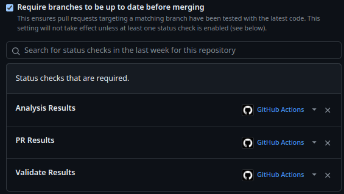

#### Required tools and alerts example
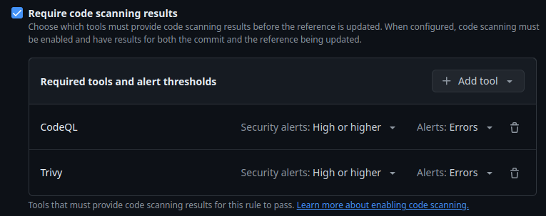


### Adding Team Members

Don't forget to add your team members!  

1.  Select Settings (gear, top right)  *> Collaborators and teams (under `Access`)
2.  Click `Add people` or `Add teams`
3.  Use the search box to find people or teams
4.  Choose a role (read, triage, write, maintain, admin)
5.  Click Add

## Security & OWASP ASVS Alignment

This repository is architected and hardened out-of-the-box to align with Levels 1 and 2 of the **OWASP Application Security Verification Standard (ASVS) v4.0.3**. A detailed security mapping matrix is documented in [SECURITY.md](file:///home/derek/Repos/quickstart-openshift/SECURITY.md#owasp-asvs-alignment), detailing our implementation of:
* **Active WAF Defense:** Inline Coraza WAF running inside the Caddy reverse proxy.
* **Tiered Isolation:** NetworkPolicies enforcing network boundaries between the frontend, backend, and database tiers.
* **Platform/Container Hardening:** Read-only root filesystems, non-root execution, privilege escalation blocks, default seccomp profiles, and drop capabilities.
* **Build-Time & Dynamic Testing:** Automated static analysis (Trivy, CodeQL), dependency auditing (Renovate, Knip), and weekly dynamic vulnerability scans (**OWASP ZAP**).

## Container Hardening & Writable Paths

Out of the box, the deployment templates in this repository enforce strict container-level security contexts:
* **Read-Only Root Filesystems:** Containers cannot write to the root filesystem at runtime (`readOnlyRootFilesystem: true`).
* **Non-Root Execution:** Containers are blocked from executing as the root user (`runAsNonRoot: true`).
* **Privilege Escalation Blocked:** Containers cannot gain more privileges than their parent process (`allowPrivilegeEscalation: false`).

### Handling Dynamic Writes
If your application requires writing files at runtime (e.g., temporary caches, uploaded attachments, config logs):
1. **Do not disable the security context.**
2. Mount a memory-backed (`tmpfs`) volume on the writable path using `emptyDir` in `openshift.deploy.yml`:
   ```yaml
             volumeMounts:
               - mountPath: /tmp
                 name: tmp
         volumes:
           - name: tmp
             emptyDir:
               medium: Memory
               sizeLimit: 256Mi
   ```
3. **Always specify a `sizeLimit`.** Running memory-backed volumes without a size limit allows a runaway container to exhaust the host node's RAM, triggering an out-of-memory (OOM) storm that will terminate other pods.

# Workflows

These workflows and actions enforce a pull request based flow.
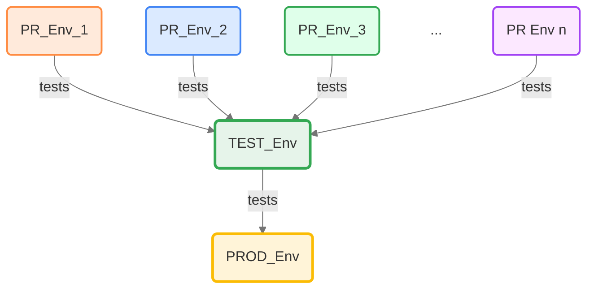
```mermaid
flowchart TD
    A1(PR_Env_1) -->|tests| B
    A2(PR_Env_2) -->|tests| B
    A3(PR_Env_3) -->|tests| B
    Ad@{ shape: text, label: "..." }
    An(PR Env n) -->|tests| B
    B(TEST_Env) -->|tests| C(PROD_Env)

    %% Define styles with good contrast for light/dark modes
    %% PR Environments (using distinct, reasonably bright colors)
    style A1 fill:#ffeadb,stroke:#ff8c42,stroke-width:2px,color:#5c3d1e  %% Light Orange/Orange
    style A2 fill:#dbeaff,stroke:#4285f4,stroke-width:2px,color:#1a3f7a  %% Light Blue/Blue
    style A3 fill:#dfffea,stroke:#34a853,stroke-width:2px,color:#154b24  %% Light Green/Green
    style An fill:#fce8ff,stroke:#a142f4,stroke-width:2px,color:#4d1e7a  %% Light Purple/Purple
    %% TEST Environment
    style B fill:#e6f4ea,stroke:#34a853,stroke-width:3px,color:#154b24  %% Lighter Green/Green
    %% PROD Environment
    style C fill:#fff4d8,stroke:#fbbc05,stroke-width:3px,color:#7a5f01  %% Light Gold/Gold

    %% Link style
    linkStyle default stroke:#757575,stroke-width:1px
```

Here's a more detailed view showing a single pull request.

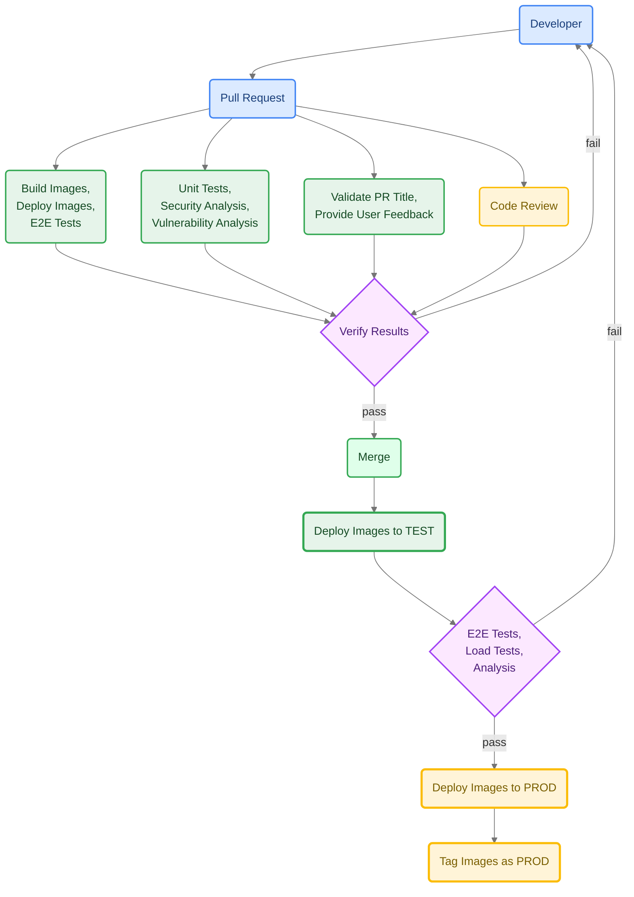
```mermaid
flowchart TD
    A(Developer)
    B(Pull Request)
    Ba(Build Images,<br/>Deploy Images,<br/>E2E Tests)
    Bb(Unit Tests,<br/>Security Analysis,<br/>Vulnerability Analysis)
    Bc(Validate PR Title,<br/>Provide User Feedback)
    Bd(Code Review)
    C{Verify Results}
    D(Merge)
    E(Deploy Images to TEST)
    F{E2E Tests,<br/>Load Tests,<br/>Analysis}
    G(Deploy Images to PROD)
    H(Tag Images as PROD)

    A --> B
    B --> Ba --> C
    B --> Bb --> C
    B --> Bc --> C
    B --> Bd --> C
    C -- fail --> A
    C -- pass --> D --> E --> F
    F -- fail --> A
    F -- pass --> G --> H

    %% Define styles with good contrast for light/dark modes
    %% Developer & PR Actions (Blue)
    style A fill:#dbeaff,stroke:#4285f4,stroke-width:2px,color:#1a3f7a
    style B fill:#dbeaff,stroke:#4285f4,stroke-width:2px,color:#1a3f7a
    %% PR Checks & Validation (Light Green)
    style Ba fill:#e6f4ea,stroke:#34a853,stroke-width:2px,color:#154b24
    style Bb fill:#e6f4ea,stroke:#34a853,stroke-width:2px,color:#154b24
    style Bc fill:#e6f4ea,stroke:#34a853,stroke-width:2px,color:#154b24
    %% Code Review (Light Gold - requires attention)
    style Bd fill:#fff4d8,stroke:#fbbc05,stroke-width:2px,color:#7a5f01
    %% Decision Points (Purple)
    style C fill:#fce8ff,stroke:#a142f4,stroke-width:2px,color:#4d1e7a
    style F fill:#fce8ff,stroke:#a142f4,stroke-width:2px,color:#4d1e7a
    %% Merge & TEST Deployment (Green)
    style D fill:#dfffea,stroke:#34a853,stroke-width:2px,color:#154b24
    style E fill:#e6f4ea,stroke:#34a853,stroke-width:3px,color:#154b24
    %% PROD Deployment & Tagging (Gold)
    style G fill:#fff4d8,stroke:#fbbc05,stroke-width:3px,color:#7a5f01
    style H fill:#fff4d8,stroke:#fbbc05,stroke-width:3px,color:#7a5f01

    %% Link style
    linkStyle default stroke:#757575,stroke-width:1px
```

## Pull Request

Runs on pull request submission.

* Provides safe, sandboxed deployment environments
* Build action pushes to GitHub Container Registry (ghcr.io)
* Build triggers select new builds vs reusing builds
* Deploy only when changes are made
* Deployment includes curl checks and optional penetration tests
* Run tests (e2e, load, integration) when changes are made
* Other checks and updates as required

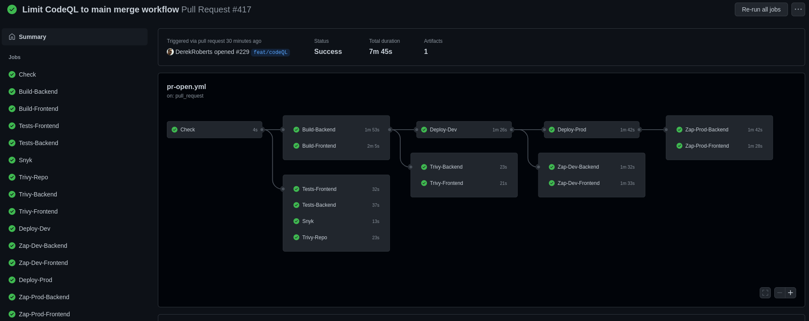

## Validation

Runs on pull request submission.

* Enforces conventional commits in PR title
* Adds greetings/directions to PR descriptions

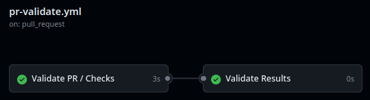


## Analysis

Runs on pull request submission or merge to the default branch.

* Unit tests (should include coverage)
* CodeQL/GitHub security reporting (now handled as GitHub default!)
* Trivy password, vulnerability and security scanning

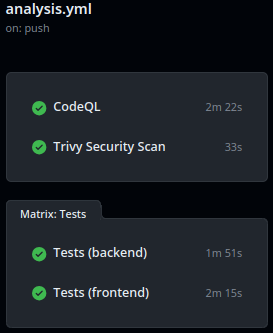

## Pull Request Closed

Runs on pull request close or merge.

* Cleans up OpenShift objects/artifacts
* Merge retags successful build images as `latest`

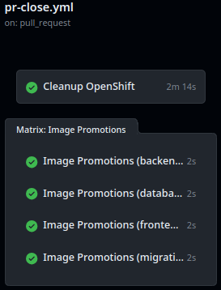

## Merge

Runs on merge to main branch.

* Code scanning and reporting to GitHub Security overview
* Zero-downtime* TEST deployment
* Penetration tests on TEST deployment (optional)
* Zero-downtime* PROD deployment
* Labels successful deployment images as PROD
* Sysdig email alerts synced to PROD (no-op if `SYSDIG_API_TOKEN` is unset)

\* excludes database changes

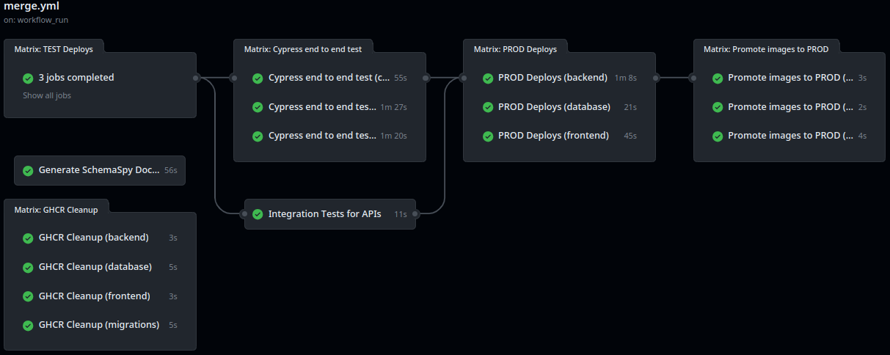

## Scheduled

Runs on scheduled job (cronjob) or workflow dispatch.

* PR environment purge
* Generate SchemaSpy documentation
* Tests (e2e, load, integration) on TEST deployment

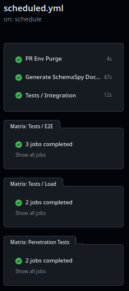

# Maintenance Mode Automation

This repository supports operating downstream projects in a low-maintenance, sustainment-only mode. When configured, dependency updates can be completely automated with zero manual intervention required for minor and patch updates, and optional hands-off major version bumps.

## How It Works

1. **Automated Dependency Updates**: The repository includes a `renovate.json` file configured to extend [`bcgov/renovate-config`](https://github.com/bcgov/renovate-config). This allows Mend Renovate to scan for updates, group related package updates together, and prepare automated Pull Requests.
2. **Branch Protection & Gated Merging**: GitHub branch protection rules on `main` ensure that no PR is merged without verifying that the application remains functional.
3. **CI/CD Validation**: The `PR` workflow builds, deploys, and runs tests against sandboxed preview environments; `PR Validate` enforces PR title/description conventions.
4. **(Optional) Automerging**: If Renovate automerge is enabled and all required checks pass, Renovate can merge updates back to the `main` branch, triggering an automated rolling deployment.

## Maintenance Mode Readiness Checklist

Before transitioning an application utilizing this template to full maintenance mode, downstream teams should verify and meet the following criteria:

- [ ] **Robust Automated Test Coverage**: A high test coverage threshold (e.g., 70% or higher for both statements and branches) should be enforced. Unit, integration, and end-to-end tests must be capable of catching regressions automatically.
- [ ] **PR Preview Environments**: Ensure sandboxed preview environments deploy reliably to OpenShift for all pull requests.
- [ ] **Automated Smoke Tests / Probes**: The application must implement runtime health checks that verify connectivity to database instances and external downstream services (e.g., S3, Keycloak, or mail services).
- [ ] **Automerge Policies**: Verify that the Mend Renovate GitHub app is integrated and allowed to manage automerges for passing builds.

## Runtime Health Checks & Smoke Testing

To safely automate dependency updates, runtime health checks are mandatory to catch runtime connectivity failures before an update is merged.

### QuickStart Health Check Implementation

This template provides out-of-the-box support for self-healing and verification through container probes:
- **NestJS Backend**: Implements an `/api/health` endpoint using NestJS Terminus (currently checks DB connectivity via Prisma).
- **Frontend (Caddy/Vite)**: OpenShift readiness/liveness probes are configured to check `/` to confirm the web server is responsive and serving assets.

*Tip: For a fully mature maintenance mode setup, customize the backend health checks to query external APIs and database migrations. If a dependency goes down, the health check should return `503 Service Unavailable`, blocking the automated merge.*

## Automerge Expectations

### When Automerge Occurs
- Renovate creates PRs for dependency updates (npm packages, GitHub Actions, Docker base images).
- All status checks pass successfully:
  - Linting and unit tests complete.
  - Preview environment successfully deploys to OpenShift.
  - Automated smoke tests verify the preview environment is fully functional.
- No merge conflicts are detected.

### When Manual Intervention is Needed
- A dependency upgrade causes compile, build, lint, or test failures.
- A smoke test or deep health check fails post-deployment.
- A security vulnerability scanner (e.g., Trivy or CodeQL) flags a new vulnerability.


