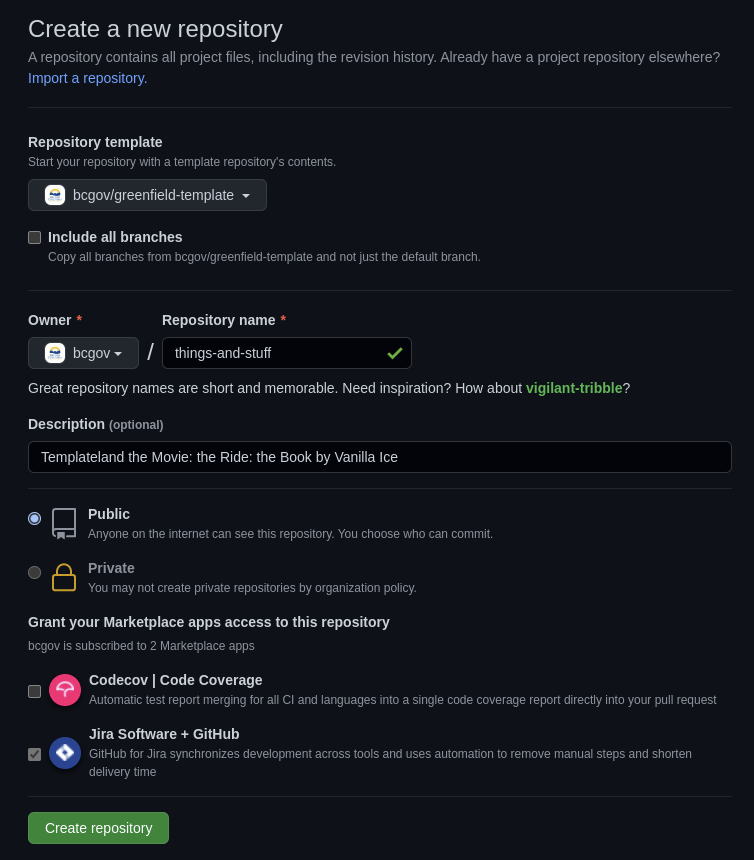

# Getting Started

Initial setup is intended to take four hours or less.  This depends greatly on intended complexity, features selected/excluded and outside cooperation.

## Contents

* Documentation:
    * *.md
* Workflows:
    * Pull Request-based (.github/workflows/pr-open.yml)
    * On Close (.github/workflows/pr-close.yml)
    * Main Merge (.github/workflows/main.yml)
* Hello World! starter application
    * TypeScript source in src/
    * One Jest test in test/
    * JavaScript container in Dockerfile
* Misc:
    * nestjs
    * eslint
    * lint-staged

Not included:

* Repository secrets
* Environment secrets
* Issues
* Pull requests
* JavaScript (transpiled/created in dist/)


## Prerequisites

The following are required:

* BC Government IDIR accounts for anyone submitting requests
* GitHub accounts for all participating team members
    * [Sign Up is free](https://github.com/signup)
* Membership in the BCGov GitHub organization
    * Provide GitHub IDs to [BCGov's Just Ask](https://just-ask.developer.gov.bc.ca/)
* Project namespaces (pick one):
    * OpenShift - [Register a New Project](https://registry.developer.gov.bc.ca/public-landing)
    * Amazon Web Services - coming soon!


## Consuming This Template



Create a new repository using this repository as a template.
* Select bcgov/nr-quickstart-typescript under Repository template
* Check Codecov | Code Coverage to grant access
* Jira cannot be unchecked (I try every time!)


## Setting Up the GitHub Repository


### Pull Request Handling

Squash merging is recommended for simplified histories ad ease of rollback.

Cleaning up merged branches is recommended for your DevOps Specialist's fragile sanity.

From GitHub:
1. Select Settings (gear, top right) -> General (selected automatically)
2. Scroll to Pull Requests
    * `[check] Allow squash merging`
    * `[check] Automatically delete head branches`


## Closing Repo-Mountie Issues

repo-mountie is a BCGov bot that likes to spam us.  Here are a few issues to expect.

Lets use common phrasing
 * Includes examples of inappropriate and preferred phrasing
 * The default branch should be named `main`
 * Close the issue

Add missing topics
 * Topics improve discoverability
 * Directions will be included
 * Close the issue


## Action Secrets

Action Secrets are consumed by workflows, including 3rd party Actions.  Please use Environment secrets for highly sensitive content.

Manage Action Secrets from your Repo > Settings > Secrets > Actions.


### Required

**GHTOKEN**

* Default token, not viewable, common to all repositories
* Variable: `{{ secrets.GHTOKEN }}`

**GHPROJECT_TOKEN** (TODO: check that this is still in use)

* Personal Access Token for writing to Pull Requests
* Variable: `{{ secrets.GHPROJECT_TOKEN }}`

**OC_SERVER**

* OpenShift server address
* Variable: `{{ secrets.OC_SERVER }}`
* Value (pick one of):
    * `https://api.gold.devops.gov.bc.ca:6443`
    * `https://api.silver.devops.gov.bc.ca:6443`


### Optional

Provide these tokens or comment their jobs out:

* ./github/workflows/pr-open.yml
* ./github/workflows/main.yml

**SNYK_TOKEN**

* Vulnerability, dependency and infrastructure code scanning
* Acquire a free token at [Snyk.io](https://snyk.io/)
* Variable: `{{ secrets.SNYK_TOKEN }}`

**SONAR_TOKEN**

* Code quality and security scanning
* Request to [import a GitHub repository](https://github.com/BCDevOps/devops-requests/issues/new/choose)
* Variable: `{{ secrets.SONAR_TOKEN }}`


## Environment Secrets

Secrets can be grouped into and protected by Environments.  [Features include](https://docs.github.com/en/actions/deployment/targeting-different-environments/using-environments-for-deployment):

* Required reviewers
* Wait timer
* Deployment branches

Manage Environments and their Secrets from your Repo > Settings > Environments.

**Environment: dev**

Create a new Environment to hold the keys to our development deployment.

Environment name: `dev`

No protection rules are required yet:

 * [`unchecked`] Required reviewers
 * [`unchecked`] Wait timer
 * Deployment branches: `All branches`

**Environment: prod**

Create a new Environment to hold the keys to our development deployment.

Environment name: `prod`

Protection rules are required:

 * [`check`] Required reviewers
   * Provide GitHub IDs as appropriate
 * [`unchecked`] Wait timer
 * Deployment branches: `All branches`

### Required

**NAMESPACE**

* OpenShift Development namespace (see **Prerequisites**)
* Variable: `{{ secrets.OC_NAMESPACE }}`

**OC_TOKEN**

* OpenShift pipeline account token (see **Getting an OpenShift Account Token**)
* Variable: `{{ secrets.OC_TOKEN }}`


#### Getting an OpenShift Account Token

Please assume that your OpenShift platform team has provisioned a pipeline account.

1. Login to your OpenShift cluster
    * E.g. BCGov [Gold](https://console.apps.silver.devops.gov.bc.ca/) or [Silver](https://console.apps.silver.devops.gov.bc.ca/)
2. Select your DEV namespace (provided by the OpenShift platform team)
3. Select Secrets (under Workloads for Administrator view)
4. Select `pipeline-token-...` or a similarly privileged token
5. Under Data, copy `token`
6. Paste into the GitHub Environment Secret `OC_TOKEN` (see above)

## First Pipeline Run

By now all relevant tokens should be provided.  We are going to assume that Synk and SonarCloud aren't on hand yet, so let's comment themout.  Please revise as appropriate.

Steps in this section use a terminal.  Several GUIs alternatives are avilable, but out of scope.

Required:
* Git CLI installed and configured
* Access to a command prompt:
    * Linux command terminal
    * MacOS command terminal
    * Windows Subsystem for Linux (WSL)


### Create a Branch and Make Changes

1. Create and switch to a new branch
    ```
    git checkout -b <new-branch-name>
    ```
2. Edit the following workflows
    * Pull Requests: `.github/workflows/pr-open.yml`
    * Main Merge: `.github/workflows/main.yml`
3. Comment out the following jobs
    * `snyk` (PR only)
    * `sonarcloud` (both)
3. Stage changes and create commits (repeat as necessary)
    ```
    git add .github/workflows/
    git commit -m "Pipeline: comment out snyk and sonarcloud"
    ```
4. Push the commits
    ```
    # First time only
    git push -u origin <new-branch-name>

    # Subsequent times
    git push origin
    ```

### Create a Pull Request

This is where things start to get exciting!

From your GitHub repository:
1. Select *Pull Requests*
2. Click *New pull request* (big green button)
    * Title: `Pipeline: comment out snyk and sonarcloud`
    * Body: `Pipeline: comment out snyk and sonarcloud`
    * Target Branch: `<new-branch-name>`
    * Source Branch: `main`
3. Proceed according the the pipeline's directions!


## Packages

Packages are available from your repository (link on right) or your organization's package lists.

E.g. https://github.com/orgs/bcgov/packages?repo_name=nr-quickstart-typescript


### Branch Protection

This is required to prevent direct pushes and merges to the default branch.  One full pipeline run must be completed before Make sure that `main` is the default branch.

From GitHub:
1. Select Settings (gear, top right) -> Branches (under Code and Automation)
2. Click `Add Rule` or edit an existing rule
3. Under `Protect matching branches` specify the following:
    * Branch name pattern: `main`
    * `[check] Require a pull request before merging`
        * `[check] Require approvals` (default = 1)
        * `[check] Dismiss stale pull request approvals when new commits are pushed`
        * `[check] Require review from Code Owners`
    * `[check] Require status checks to pass before merging`
        * `[check] Require branches to be up to date before merging`
        * `Status checks that are required` requires to the search box to select:
            * `Check`
            * `Tests-Backend`
            * `Tests-Frontend`
            * `Build-Backend`
            * `Build-Frontend`
            * `Deploy-Dev`
            * `Deploy-Prod`
            * `Trivy-Repo`
            * `Trivy-Backend`
            * `Trivy-Frontend`
            * `Zap-Dev-Backend`
            * `Zap-Dev-Frontend`
            * `Zap-Prod-Backend`
            * `Zap-Prod-Frontend`
            * `SonarCloud` (optional)
    * `[check] Require conversation resolution before merging`
    * `[check] Include administrators` (optional)


## Adding Team Members

Don't forget to add your team members!  

From GitHub:
1. Select Settings (gear, top right) -> Collaborators and teams (under Access)
2. Click `Add people` or `Add teams`
3. Use the search box to find people or teams
4. Choose a role (one of)
    * `Read`
    * `Triage`
    * `Write`
    * `Maintain`
    * `Admin`
5. Click *Add <person-or-team>*


## Troubleshooting

* If failed to get authentication at the build docker image stage, check if updated to use the secrets [GHCR token and username](https://github.com/marketplace/actions/docker-build-push-action), the default GitHub token might not work

* If failed to authenticate to openshfit at the deploy stage, check if the service account “pipeline” has the right ability to get project and do deploy

* If networking is unsuccessful, even with routes in place, try adding network policies for ingress and inter-namespace traffic.
    ```
    oc process -f .github/openshift/networkPolicies.yml | oc apply -f -
    ```
